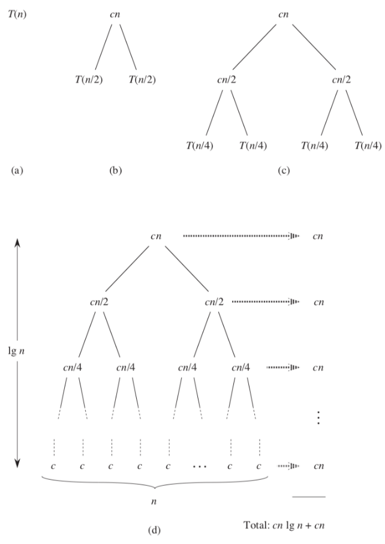
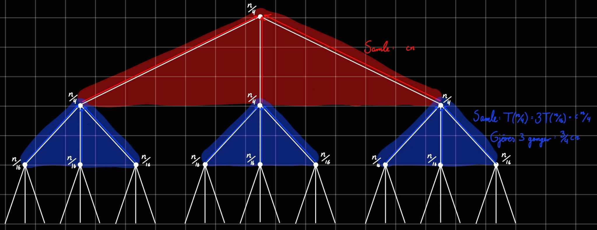
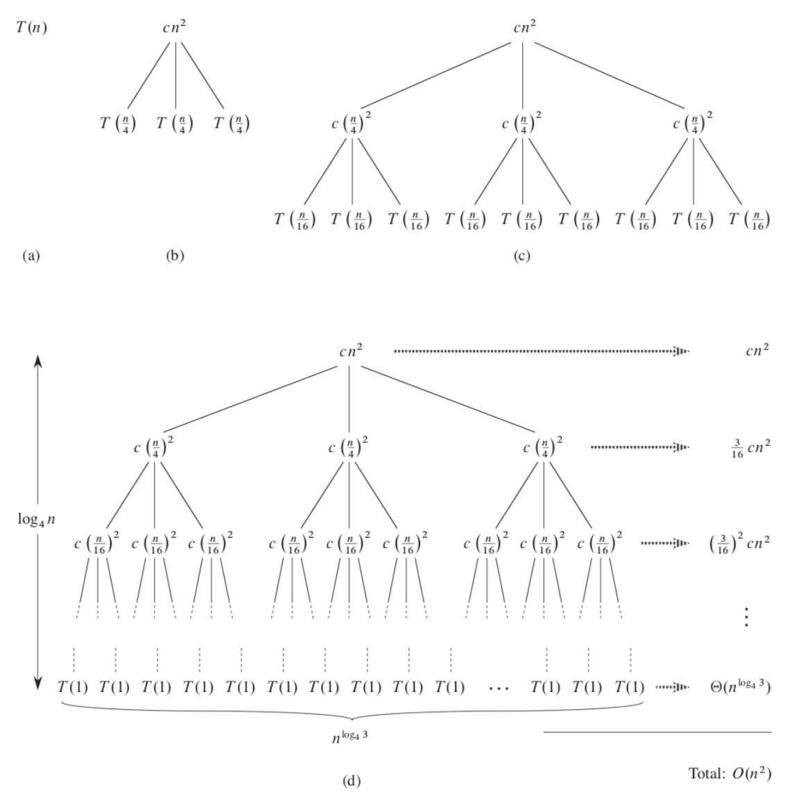
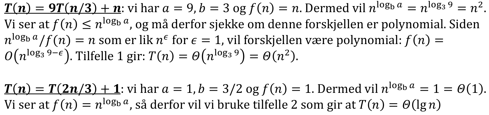
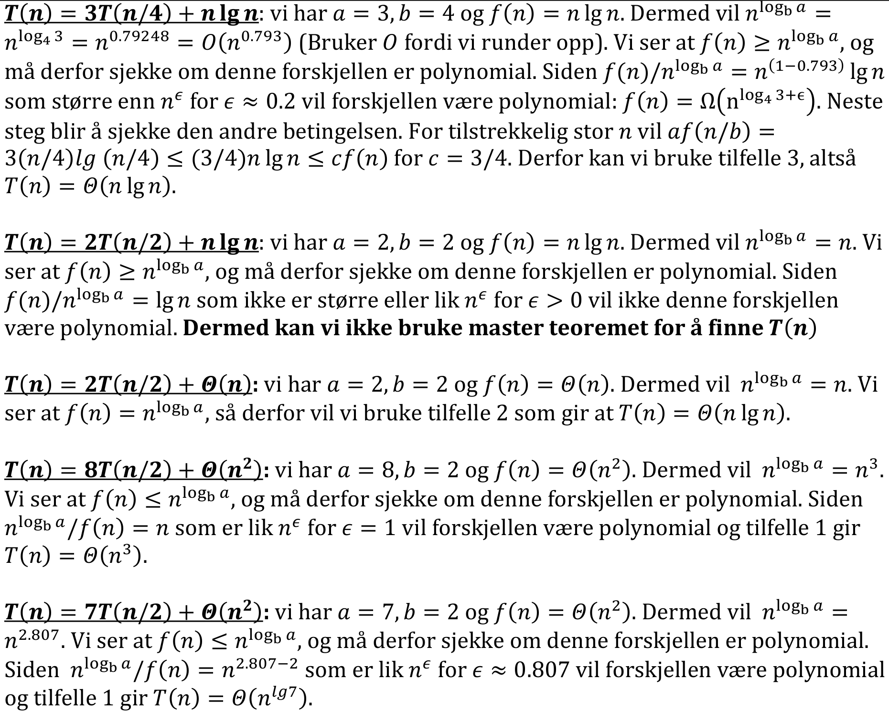

# Innhold
- [Forelesning 3 - Splitt og hersk](#forelesning-3---splitt-og-hersk)
    - [2.3 Design av algoritmer](#kapittel-23---design-av-algoritmer)
    - [Kapittel 4 - Splitt og Hersk Metoder](#kapittel-4---splitt-og-hersk-metoder)
        - [4.3 Substitusjonsmetoden](#43-substitusjonsmetoden)
        - [4.4 Rekursjonstre metoden](#44-rekursjonstre-metoden)
    - [Kapittel 7 - Quicksort](#kapittel-7---quicksort)
        - [7.1 Beskrivelse av quicksort](#71-beskrivelse-av-quicksort)
        - [7.3 En randomisert versjon av quicksort](#73-en-randomisert-versjon-av-quicksort)
    - [Appendiks B - Iterasjonsmetoden](#appendiks-b---iterasjonsmetoden)
    - [Appendiks C - Binærsøk](#appendiks-c---binærsøk)

# Forelesning 3 - Splitt og hersk
- Rekurseiv dekomponering er viktig
    - Deler instans i mindre biter, løser problem rekusivt for mindre biter og kombinerer løsningene
- Læringsmål:
    - Forstå *divide-and-conquer* (*splitt og hersk*)
    - Forstå BISECT og BISECT' (se appendiks C i pensumheftet)
    - Forstå MERGE-SORT
    - Forstå QUICKSORT og RANDOMIZED-QUICKSORT
    - Kunne løse rekurrenser med *substitusjon*, *rekursjonstrær* og *masterteoremet*
    - Kunne løse rekurrenser med *iterasjonsmetoden* (se appendiks B i pensumheftet)

## Kapittel 2.3 - Design av algoritmer
#### Divide-and-conquer tilnærming
- Rekursive algoritmer løser problemer ved å kalle seg selv for å løse delproblemer
- Divide-and-conquer har tre steg:
    - Divide: sekvens av $n$ elementer som skal sorteres deles i delsekvenser med $\frac{n}{2}$ elementer
    - Conquer: løser delproblemer rekursivt, eller rett frem om de er små nok
    - Combine: slå sammen løsninger på delproblemene for å lage løsning på originalt problem

#### Merge-sort algoritmen
- Divide: deler sekvensen i delsekvenser med $\frac{n}{2}$ elementer hver
- Concuer: delsekvensene sorteres rekursivt vha merge sort
- Combine: sorterte delsekvenser slås sammen til sortert sekvens
- Rekursjonen deler opp til delsekvensene har lengde 1

##### MERGE
- Kombinerer delsekvenser med `MERGE(A,p,q,r)` (`A` er array, `p`, `q`, og `r` er indexer i `A` så `p ≤ q < r`)
    - `MERGE` antar `A[p,q]` og `A[q+1,r]` er sortert
    - Kjøretid: $\theta(n)$, $n=r-p+1$ er antall elementer som fusjoneres
    - Første element i `A[p,q]` sammenlignes med første element i `A[q+1,r]`, fjerner minste element fra subarray, plasseres ved første posisjon i `A[p,r]`. Skjer til alle elemnter er slått sammen. 
    - $\infty$ er siste element i hver subarray, så når en subarray er tom vil fortsatt elementene i den andre plasseres rett. Ferdig når begge subarrayene har elementet $\infty$

```
MERGE(A,p,q,r)
 1 n_1 = q - p + 1
 2 n_2 = r - q
 3 let L[1,n_1+1] and R[1,n_2+1]
 4 for i = 1 to n_1
 5    L[i] = A[p+i-1]
 6 for j = 1 to n_2
 7    R[j] = A[q+j]
 8 L[n_1+1] = ∞
 9 R[n_2+1] = ∞
10 i = 1
11 j = 1
12 for k = p to r
13    if L[i] <= R[j]
14       A[k] = L[i]
15       i = i + 1
16    else A[k] = R[j]
17       j = j + 1
```

#### MERGE-SORT
- Når $p\geq r$ har subarray lengde max 1, og er sortert. Kjører derfor bare metoden når $p<Q$.
- $q$ er midt i sekvensen (rundet ned). Kaller `MERGE-SORT` på begge delene og slår de sammen med `MERGE`.

```
MERGE-SORT(A,p,r)
1 if p < r
2   q = roundDown((q+r)/2)
3   MERGE-SORT(A,p,q)
4   MERGE-SORT(A,q+1,r)
5   MERGE(A,p,q,r)
```

#### Analyse av divide-and-conquer algoritmer
- Når algoritme har rekursivt kall kan kjøretid beskrives med rekurrenslikning som beskriver total kjøretid til problem med størrelde $n$. Finner kjøretid til mindre input: $T(n)=T(n-1) + n$
- T(n) er kjøretid til problem med størrelse $n$. Om størrelsen er tilstrekkelig liten vil $n\leq c$ og løsningen tar konstant tid: $\theta(1)$
- Om man deler problemet i $a$ delproblemer med størrelsen $\frac{1}{b}$ av originalt problem tar det $T(n/b)$ tid å løse delproblem av størrelse $\frac{n}{b}$, $aT(n/b)$ for å løse $a$ delproblemer.
- Om det tar $D(n)$ å dele problemet i delproblemer og $C(n)$ tid å kombinere løsningene til delproblemene til løsning på originale problemet får vi
    $$
    T(n) = \begin{cases} 
    \theta(1) &  n \leq c \\
    aT\left(\frac{n}{b}\right) + D(n) + C(n), & \text{ellers}
    \end{cases}
    $$

#### Analyse av merge sort
- Divide: regner ut midten av subarrayen, tar konstant tid, $D(n)=\theta(1)$
- Conquer: løser rekursivt to delproblemer av størrelse $\frac{n}{2}$, totalt $2T(n/2)$ av kjøretiden 
- Compine: MERGE tar $C(n)=\theta(n)$ tid
- $D(n)+C(n)=\theta(1) + \theta(n)=\theta(n)$
    $$
    T(n)=\begin{cases}
    \theta(1) & n=1 \\
    2T(n/2)+\theta(n) & n>1
    \end{cases}
    $$
- Kan løse med rekursjonstre
- Antar $n$ er toerpotens
- Med rekursjonstre ser vi på hvert nivå av rekursive tall. Vi ser på hvor mange operasjoner som utføres utenom det rekursive kallet ($T(...)$) pluss antall rekursive kall (gitt av koeffisient til $T(...)$) 
- Figur a: $T(n)$ som kan utvides til en ekvivalennt rekurrens som i figur b
- Figur b: for et rekursivt kall $T(n)$ vil det utføres $cn$ operasjoner pluss to rekursive kall $T(n/2)$. Videreutvikler $T(n/2)$
- Figur c: For et rekursivt kall $T(n/2)$ utføres $\frac{cn}{2}$ operasjoner pluss to rekursive kall $T(n/4)
- Forsetter slik til størrelsen på problemene er 1

```
T(n) = 2T(n/2) + cn   T(1) = c

Rekursive kall               Tre

T(n)                     /--- cn ---\
                        /            \
T(n/2)                cn/2          cn/2
                     /    \        /    \  
T(n/4)             cn/4  cn/4    cn/4   n/4   
``` 


- Summerer så kostnadene ved hvert nivå av treet
    - Øverste nivå har kostnat $cn$, andre har $\frac{cn}{2}+\frac{cn}{2}=cn$ osv
    - Hvert nivå $i$ har $2^i$ noder med kostnad $\frac{cn}{2^i}$

- Eksempel


### Binary search

#### Iterativ binary search
```
BINARY-SEARCH(A,v):
 1 low = 1
 2 high = A.length
 3 while (lov <= high)
 4   mid = roundDown((low + high)/2) 
 5   if (A[mid] == v)
 6      return mid   
 7   else if (A[mid] < v)
 8      low = mid + 1
 9   else
10      high = mid - 1
11 return NIL
```

#### Rekursiv binary search
```
BINARY-SEARCH(A,v,low,high)
1 if (low <= high)
2    mid = roundDown((low + high)/2)
3    if v == A[mid]
4       return mid
5    else if (A[mid] < v)
6       BINARY-SEARCH(A,v,mid+1,high)
7    else 
8       BINARY-SEARCH(A,v,low,mid-1)
9 else return NIL
```

## Kapittel 4 - Splitt og Hersk Metoder

- Splitt og hersk har tre nøkkeltrinn:
    - Divide: dele problem i mindre delproblemer
    - Conquer: løs delproblemer rekursivt
    - Combine: kombiner løsningene på delproblemene
- Rekursive tilfeller: delproblemene krever rekursive løsninger
- Base tilfellet: delproblemene er så små at de ikke trenger det

#### Rekurrenser
- Naturlig måte å karakterisere kjøretid til splitt og hersk algoritmer. Beskriver funksjon i forhold til funksjonsverdiene på mindre input.
    - Om rekursiv algoritme deler problemer til ulik størrelse (f.eks. 2/3 og 1/3), og oppdeling og kombinering tar lineær tid, blir rekurrensen $T(n)=T(2n/3) + T(n/3) + \Theta(n)$
- Tre måter å løse rekurrenser på:
    - Substitusjonsmetoden: gjetter grense og bruker induksjon for å sjekke gjetning
    - Rekursjonstre metoden: omdanner rekurrens til tre hvor nodene representerer kostnadene ved forskjellige nivå av rekursjon
    - Master metoden: bruker rekurrenser på form $T(n)=aT(n/b)+f(n)$, hvor $a$ delproblemer hver med størrelse $n/b$ og oppdelingen og kombinasjonen tar $f(n)$ tid

#### Tekniske detaljer ved rekurrenser
- Utelater ofte ganger som når oddetall må rundes opp eller ned
- Grensebetingelser (som $T(n)=\theta(1)$ for tilstrekkelig liten $n$) utelates også ofte

### 4.3 Substitusjonsmetoden
- Løser rekurrenser i to steg
    1. Tippe formen til løsningen
    2. Bruke induksjon for å finne konstanter og vise at løsningen er riktig
- Metoden etablerer øvre eller nedre grense for rekurrens
    - Eksempel: finne øvre grense for $T(n)=2T(⌊n/2⌋)+n$
        - Tipper løsningen $O(n\log(n))$, skal vise grensen $T(n)\leq cn\log(n)$ for konstant $c$ ($\leq$ siden vi har tippet $O$)
        - $T(⌊n/2⌋)$ i rekurrensen hjelper med å sette grensen 
        - Input $⌊n/2⌋$ gir grensen $T(⌊n/2⌋)\leq c⌊n/2⌋\log(⌊n/2⌋)$
        - Setter $T(⌊n/2⌋)$ i rekurrens

        $$
        \begin{align*}
        T(n) &= 2T(⌊n/2⌋)+n \\
        T(n) &\leq 2(c⌊n/2⌋\log(⌊n/2⌋)) + n \\
        &\leq cn\log(n/2)+n \\
        &=cn\log(n)-cn\log(2)+n \\
        &=cn\log(n)-cn+n\\
        &\leq cn\log(n) \\
        \end{align*} \\ 
        $$

        - Viser at løsningen holder for store $n$ og $c\geq 1$, må vise det holder for grensebetinelsene. Mp vise at om man velger høy nok $c$ vil grense $T(n)\leq cn\log(n)$, også for liten $n$.  
        - $n=1$ gir $T(1)\leq0$ ifølge antagelsen, selv om $T(1)=1$. Løser ved å sette en $n_0$ som gir $n>n_0$
        - Grunntilfellene $T(2)$ og $T(3)$ brukes som grunntilfeller i induktivt bevis, så $n_0=2$- Grunntilfellet for rekurrensen er fortsatt $T(1)$ $T(2)=3, T(3)=5$
        - Må vise vi kan velge $c$ så $T(2)\leq c2\log(2)$ og $T(3)\leq c3\log(3)$, som stemmer for $x\geq 2$
        - Har vist løsningen holder for grunntilfeller og store $n$, og derfor stemmer gjetning $T(n)=O(n\log(n))
#### Tippe bra
- Bruke rekursjonstrær og erfaring til å gjette 
- Kan starte med $T(n)=\Omega(n)$ og $T(n)=O(n^2)$, før man tighter det og setter til $T(n)=\theta(n\log(n))$

#### Variabelskifte
- Kan bruke algebra for å manipulere ukjente rekurrenser til form vi kan
- $T(n)=2T(⌊\sqrt(n)⌋)+\log(n)$
    - Glemmer floor funksjon og setter $m=\log(n)$ ($n=2^m$)
    - $T(2^{m/2})=2T(2^{m\cdot 1/2})+\log(2^m) \to T(2^{m/2})=2T(^{m/2})+m$
    - Endrer notasjon: $S(m)=T(2^m)$, rekurrensene har samme verdi, men ulike variabler. $T(2^{m/2})=S(m/2)$
        - $S(m)=2S(m/2)+m$
        - Ligner rekurrens fra forrige side, og har samme løsning $S(m)=O(m\log(m))$. $S(m)=T(2^m)=O(m\log(m))$. $m=\log(n)\to T(n)=T(2^m)=O(m\log(m))=O(\log(m\log(\log(m))))$

### 4.4 Rekursjonstre metoden
- Gjette løsning til $T(n)=3T(n/4)+\theta(n^2)$. Siden avrunding ikke spiller stor rolle gjør vi om til $T(n)=3T(n/4)+cn²$
- Antar $n$ er firerpotens, så størrelsen til delproblemene er $\frac{n}{4^i} heltall$
- Figur a: $T(n) utvides
- Figur b: Representerer rekurrensen ekvivalent med $T(n)$. Roten $cn²$ er antall operasjoner ved øverste nivå av rekursjon, mens tre forgreningene er kostnadene forbundet med delproblemene med størrelse $\frac{n}{4}$. Gir kostnaden ved tre rekursive kall $3T(n/4)$
- Figur c: Kostnad til tre rekursive kall utvides. For $T(n/4)$ utføres $c(n/4²)$ operasjoner pluss tre rekursive kall: $3T(n/16)$
- Figur d: Fortsetter utvidelse av hver node til $T(1)$



- Hver utvidelse reduserer størrelsen på delproblemene med faktor på $4$. vil nå grensebetingelse. Størrelsen på delproblemene ved nivå $i$ er $\frac{n}{4^i}$. Blir $1$ når $\frac{n}{4^i}=1 \to i = \log_4(n)$. Treet har derfor $log_4(n)+1$ nivåer ($0,1,2,...,log_4(n)$).
- Kostnad til hver node på nivå $i$ er $c(n/4^i)²$, fordi størrelsen av hver node er $\frac{n}4^i$. Hvert nivå gir tre ganger antall noder som nivået over, så antall noder er $3^i$ på nivå $i$. Total kostnad for nivå $i$ blir $3^ic(n/4^i)²=(3/16)^icn²$
- Kostnad for hele treet blir kostnadene av hvert nivå summert sammen. Bunnen er $i=\log_4(n)$ der antall noder er $3^{\log_4 n}=n^{log_4 3}$. Total kostnad blir $n^{\log_4 3}T(1)$, som er $\theta(n^{\log_4 3}) når $T(1)$ er konstant. Finner den totale kostnaden 
$$T(n)=\sum_{i=0}^{\log_4(n)-1}(\frac{3}{16}^i)cn²+\theta(n^{\log_43})$$
- Bruker 
    $$\sum_{k=0}^nx^k=\frac{x^{n+1}-1}{x-1}$$
    og får 
    $$T(n)=\frac{(3/16)^{\log_4n}-1}{(3/16)-1}cn²+\theta(n^{\log_43})$$
    - Rekursjonstre krever ikke at man er veldig nøyaktige, bruker geometrisk serie $\sum_{k=0}^nx^k=\frac{1}{1-x}$ som øvre grense
        $$
        T(n)<\sum_{i=0}^\infty+\theta(n^{log_43})=\frac{1}{1-3/16}cn²+\frac{16}{13}cn²+\theta(n^{\log_43})=O(n²)
        $$
        Har funnet at vi kan gjette: $T(n)=O(n²)$
### Master teoremet
- Masterteoremet løser rekurrenser på formen: $T(n)=aT(n/b)+f(n)$ hvor $a\geq 1$ og $b>1$ er konstanter og $f(n)$ er asymptotisk positiv funksjon
- Rekurrens beskriver kjøretid til algoritme
    - Størrelse på algoritme: $n$
    - Antall delproblemer: $a$
    - Størrelse på delproblemer: $n/b$
    - Delproblemer løses rekursivt på tid $T(n/b)$
    - Tid for å dele opp og kombinere problemet: $f(n)$
- La $a\geq 1$ og $b>1$ være konstanter, f(n) asymptotisk positiv funksjon og $T(n)$ definert rekurrense: $T(n)=aT(n/b)+f(n)$
- Tre scenarioer, hvor $T(n)$ har ulike grenser
    1. Hvis $f(n)=O(n^{\log_b(a-\epsilon)})$ for en konstant $\epsilon>0$, er $T(n)=\theta(n^{\log_b(a)})$
    2. Hvis $f(n)=\theta(n^{\log_b(a)})$ er $T(n)=\theta(n^{\log_b(a)}\log(n))=\theta(f(n)\log(n))$
    3. Hvis $f(n)=\Omega(n^{\log_b(a+\epsilon)})$ for en konstant $\epsilon>0$ og at $af(n/b)\leq cf(n)$ for en konstant $c<1$ og tilstrekkelig stor $n$ så vil $T(n)=\theta(f(n))$
- Største av $f(n)$ og $n^{\log_b(a)}$
    - Tilfelle 1: $n^{\log_b(a)}$ er størst
        - $f(n)$ må være polynomial mindre enn $n^{\log_b(a)}$, sjekkes ved $n^{log_b(a)}/f(n)$, sjekker om den er asymptotisk mindre eller lik $n^\epsilon$
    - Tilfelle 2: like store, multipliserer med logaritmisk faktor
    - Tilfelle 3: $f(n)$ er størst
        - $f(n)$ må være polynomial større enn $n^{\log_b (a)}$, sjekkes ved $f(n)/n^{\log_b a}$, sjekker om den er asymptotisk større eller lik $n^\epsilon$
#### Eksempler for bruk av master teoremet



## Kapittel 7 - Quicksort
- Worst-case kjøretid: $\theta(n²)$
- Har dårlig worst case, men kort average kjøretid: $\theta(n\log(n))$ med små faktorer
- Sorterer in place

### 7.1 Beskrivelse av quicksort
- Bruker divide-and-conquer metoden
    - Divide: Array $A[p,r]$ deles i to subarrays $A[p,q-1]$ og $A[q+1,r]$, så alle elementene i $A[p,q-1]$ er mindre eller lik $A[q]$ og alle i $A[q+1,r]$ er større eller lik $A[q]$. Utregningen av $q$ er del av oppdelingen.
    - Conquer: sorter to subarrayer med rekursivt kall til quicksort
    - Combine: to subarrayer er allerede sortert, krever ikke ekstra arbeid å kombinere de. $A[p,r] er sortert.

#### Partition
- Deler $A$ ved sammenligning med pivotelement
- Omorganiserer subarray $A[p,r]$ innenfor gitt plass
- Velger pivotelement $x$, setter det lik $A[r]$ (siste element i array)
- Andre elementer i subarrayen sammenlignes med $x$. Index $i$ brukes for å plassere elementene mindre enn $x$. 
- Om element er mindre eller lik pivotelement bytter det plass med element ved $i+1$ (posisjon til høyre for skille mellom områdene)
```
PARTITION(A,p,r)
1 x = A[r]
2 i = p - 1
3 for j = p to r-1
4    if A[j] <= x
5       i = i + 1
6       exchange A[i] with A[j]
7 exchange A[i+1] with A[r]
8 return i + 1
```

#### Quicksort
- Tar inn $A$ som skal sorteres og start- og sluttpunkt
- Om $A$ ikke er tom kalles PARTITION, som deler $A$ i to, splittet av pivotelement
- Kjøres rekursivt for å sortere hele $A$
```
QUICKSORT(A,p,r)
1 if p < r
2    q = PARTITION(A,p,r)
3    QUICKSORT(A,p,q-1)
4    QUICKSORT(A,q+1,r)
```

### 7.3 En randomisert versjon av quicksort
- Randomisert quicksort gir forventet god ytelse ved alle input og brukes ofte for store input
#### Randomized partition
```
RANDOMIZED-PARTITION(A,p,r)
1 i = RANDOM(p,r)
2 exchange A[r] with A[i]
3   return PARTITION(A,p,r)
```
#### Randomized quicksort
```
RANDOMIZED-QUICKSORT(A,p,r)
1 if p < r
2    q = RANDOMIZED-PARTITION(A,p,r)
3    RANDOMIZED-QUICKSORT(A,p,q-1)
4    RANDOMIZED-QUICKSORT(A,q+1,r)
```

## Appendiks B - Iterasjonsmetoden
- Samme prinsipp som rekursjonstrær, men jobber direkte på likningene
- Bruker rekurrensen selv til å ekspandere rekursive terminer. Bruker dette som eksempel:
$$
\begin{align*}
T(0) &= 0 \\ 
T(n) &= T(n-1) + 1 \\
\end{align*}
$$

#### Fremgangsmåte 1
$$
\begin{align*}
T(n) &= T(n-1) + 1 \\
     &= T(n-2) + 2 \\
     &= T(n-3) + 3 \\
     &...\\
     &T(n-i)+i\\
     &T(n-n)+n=n
\end{align*}
$$

#### Fremgangsmåte 2
$$
\begin{align*}
T(n) &= 1 \\
&+ T(n-1) \\
\\
T(n) &= 1 \\
&+ 1 \\
&+ T(n-2)\\
\\
T(n) &= 1 \\
&+ 1 \\
&+ 1 \\
&...\\
&+T(n-(n-1)) (line: n-1)
\\
T(n) &= 1 \\
&+ 1\\
&+ 1\\
&+ 1\\
&...\\
&+ 1 (line: n-1)\\
\end{align*}
$$

## Appendiks C - Binærsøk
Array til input er sortert
#### Bisect - rekursiv
- Rekursivt binært søk
- Tar inn sortert array, start- og sluttpunkt og søkeverdi
- Om starten er mindre eller lik slutten, settes $q$ til å være ahlvparten av summen mellom start og slutt (midt mellom)
- Om verdien ved index $q$ er lik $v$ returneres index. Om verdi ved $q$ er større enn $v$, kalles `BISECT` på venstre side, om den er mindre, på høyre side
- Gjør forenklinger som ikke påvirker asymptotisk kjøretid for å finne kjøretiden:
    - $n=2^k$ for heltall $k\geq0$ så vi alltid er i midten og kan dele på to
    - Antar at $v$ finnes i $A$
    - For å sikre at vi deler på midten, antar vi at den eneste forekomsten av $v$ er $A[n], slik at vi alltid velger det høyre segmentet, $A[q+1,r]$ og finner elementet ved bunnen. Får følgende rekurrensutregning:
    $$
    \begin{align*}
    Grunntilfellet: T(1) &= 1\\
    T(n)&= T(n/2)+1\\
    &=T(n/4)+2\\
    &=T(n/8)+3\\
    ...\\
    &=T(n/2^i) + i\\
    &=T(n/n)+lg(n)=lg(n)+1\\
    \end{align*}
    $$
    - $T(n)=\theta(\log(n)+1)=\theta(\log(n))$
    ```
    BISECT(A,p,r,v)
    1 if p <= r
    2    q = roundDown((p+r)/2)
    3    if v == A[q]
    4       return q
    5    elseif v < A[q]
    6       return BISECT(A,p,q-1,v)
    7    else return BISECT(A,p,q-1,v)
    8 else return NIL
    ```
#### Bisect - iterativt 
- Iterativt binærsøk
- Fungerer ganske likt som rekursivt, men har  whileloop
- Generelt mer effektiv, da man slipper funksjonskall
    ```
    BISECT'(A,p,r,v)
    1 while p <= r 
    2    q = roundDown((p+r)/2)
    3    if v == A[q]
    4       return q
    5    elseif v < A[q]
    6       r = q-1
    7    else p = q+1
    8 return NIL
    ```