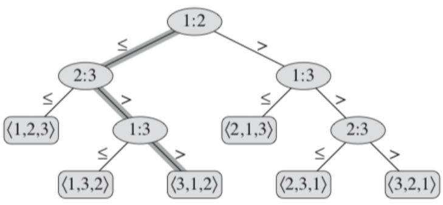
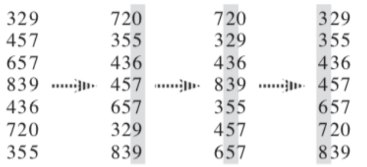

# Innhold
- [Forelesning 4 - Rangering i lineær tid](#forelesning-4---rangering-i-lineær-tid)
    - [Kapittel 8 - Sortering i lineær tid](#kapittel-8---sortering-i-lineær-tid)
        - [8.1 Nedre grense for sortering](#81-nedre-grense-for-sortering)
        - [8.2 Tellesortering](#82-tellesortering)
        - [8.3 Radikssortering](#83-radikssortering)
        - [8.4 Bøttesortering](#84-bøttesortering)
    - [Kapittel 9 - Medianer og orden statistikk](#kapittel-9---medianer-og-orden-statistikk)
        - [9.1 Minimum og maksimum](#91-minimum-og-maksimum)
        - [9.2 Seleksjon i forventet lineær tid](#92-seleksjon-i-forventet-lineær-tid)
        - [9.3 Seleksjon med worst-case lineær kjøretid](#93-seleksjon-med-worst-case-lineær-kjøretid)

# Forelesning 4 - Rangering i lineær tid
- Læringsmål:
    - Forstå hvorfor sammenligningsbasert sortering har en worst-case på $Ω(n\log(n))$
    - Vite hva en stabil sorteringsalgoritme er
    - Forstå Counting-Sort, og hvorfor den er stabil
    - Forstå Radix-Sort, og hvorfor den trenger en stabil subrutine
    - Forstå Bucket-Sort
    - Forstå Randomized-Select
    - Kjenne til Select

## Kapittel 8 - Sortering i lineær tid

### 8.1 Nedre grense for sortering
- Kun sammenligninger av elementer som gir info om rekkefølge til input sekvens $<a_1, a_2,...,a_n>$. Utfører tester ($a_i<a_j,a_i\leq a_j, a_i=a_j,a_i\geq a_j$ eller $ a_i>a_j$) for å bestemme deres relative rekkefølge
    - Antar at alle input elementer er distinkte, så alle sammenlikninger kan være $a_i\leq a_j$

#### Valgtre modellen
- Valgtre er fullstendig binært tre (to barnenoder). Representerer sammenligningene mellom elementer som utføres av sorteringsalgoritme som opererer på 

- Figur viser valgtre for innsettingssortering av inputsekvens $<a_1=6, a_2=8; a_3=5>$. Utføring av algoritmen korresponderer til å følge en rute fra roten til bladet. Alle blader representerer en output.
    - Indre noder har formen $i:j$ og representerer $a_i\leq a_j$. Går til venstre om $a_i\leq a_j$, $a_i>a_j$ ellers
    - $a_1=6, a_2=8$, $a_1\leq a_2$, går til venstre
    - $a_2=8, a_3=5$, $a_2 > a_3$, går til høyre
    - $a_1=6, a_3=5$, $a_3 > a_1$, går til høyre
    - Får at sortert output er $<a_3,a_1,a_2> = <5,6,8>$
- Alle sorteringsalgoritmer må kunne produsere alle permutasjoner av input, siden input kan ha enhver rekkefølge på elementverdiene. Valgtreet har derfor $n!$ antall mulige outputs/løvnoder

#### $\Omega(n\log(n))$ - en nedre grense for worst-case
- Worst-case antall sammenligninger vil være lengste ruten fra roten til bladet. Er samme som høyden av treet.
- Nedre grense for høyden til valgtreet er derfor nedre grense for kjøretid til sammenlikningssorteringsalgoritme

##### Teorem 8.1
Enhver sammenligningssortering krever $\Omega(n\log(n))$ sammenligninger i worst-case tilfellet

- For å bevise **Theorem 8.1** viser vi at høyden av valgtreet er $n\log(n)$
    - Ser på valgtre med høyde $h$ og antall blader $l$. Totalt $n!$ ulike output skal representeres. Binært tre med høyde $h$ kan ikke ha mer enn $2^h$ blader
        - $n! \leq l \leq 2^h$, så $n! \leq 2^h$, som gir: $h \geq \log(n!)=\Omega(n\log(n))$
            - $\log(n!)=\theta(n\log(n))$
- Heapsort og merge sort er asymptotisk optimale sammenlikningssorteringer, siden deres øvre grense er $O(n\log(n))$

### 8.2 Tellesortering
- Antar alle inputelementer er heltall i rekkevidde $0\to k$
- Når $k=O(n)$ har sorteringen kjøretid $\theta(n)$
- Tellesortering avgjør hvor mange elementer som er midnre enn inputelementet og plasserer inputelementet direkte på sin posisjon i output array

##### Counting sort
- Sorter input elementene vha antall elementer mindre eller lik element $x$. Tar inn array som skal sorteres, $A[1,n]$, array som skal holde sortert output, $B[1,n]$, og $k$ som er øvre grense for heltall i $A$
- Metoden lager array $C[0,k]$ med index $0$ til $k$
- Linje 4: sørger for at $C[i]$ er antall elementer lik $i$
    - Gjøres ved å sette $C[A[j]]$ til forrige verdi pluss 1.
- Linje 7: sørger for at $C[i]$ er antall elementer mindre eller lik $i$
    - Gjøres ved å sette C[i] lik verdien ved index $i$ pluss verdien ved $i-1$  Gjøres for alle indexer, så verdien ved $i-1$ vil alltid være verdien av alle tidligere verdier
- Linje 10: går fra enden av $A$ til 1 og fyller $B$. Sikrer stabilitet ved å gå baklengs.
    - Gjøres ved å plassere elementet fra $A$ i posisjon gitt av verdien i $C$ for det elementet. Verdien i $C$ reduseres med 1. 
```
COUNTING-SORT(A,B,k)
 1 let C[0,k] be a new array
 2 for i = 0 to k
 3    C[i] = 0
 4 for j = 1 to A.length
 5    C[A[j]] = C[A[j]] + 1
 6 // C[i] now contains the number of elements equal to i
 7 for i = 1 to k
 8    C[i] = C[i] + C[i-1]
 9 // C[i] now contains the number of elements less to or equal to i
10 for j = A.length downto 1
11    B[C[A[j]]] = A[j]
12    C[A[j]] = C[A[j]] - 1
```

#### Tellesortering analyse
- Linje 2-3 for løkke: tar $\theta(k)$ tid
- Linje 4-5 for løkke: tar $\theta(n)$ tid
- Linje 7-8 for løkke: tar $\theta(k)$ tid
- Linje 10-12 for løkke: tar $\theta(n)$ tid
- Total tid: $\theta(k+n)$
- Er stabil

### 8.3 Radikssortering

##### Radix sort
- Sorterer tallene i $A$, antar at alle har $d$ signifikante siffere
- For løkke sorterer tallene fra minst signifikant ($1$) til størst ($d$)
    - Bruker stabil sorteringsalgoritme
    - Fortsetter til $d$ signifikante siffer er sortert. Da er $A$ sortert.
    
    ```
    RADIX-SORT(A,d)
    1 for i = 1 to d
    2    use a stable sort to sort array A on digit i
    ```

#### Stabil sorteringsalgoritme
- Duplikate elementer holder plassen sin før og etter sortering. Nyttig når noe skal være sortert på fler parameter enn den man sorterer på akkurat nå, f.eks. kommuner som skal sorteres etter antall innbyggere, men hvis de har like mange innbyggere, etter areal.
- Stabile sorteringsalgoritmer:
    - Insertion sort
    - Merge sort
    - Quick sort
    - Counting sort
    - Bubble sort
- Radix sort er stabil, men sorterer ikke in place, som de fleste sammenligningssorteringsalgoritmer. Derfor bruker man en annen, som quicksort, om minne er viktig.

#### Radikssortering analyse

##### Radikssortering - lineær kjøretid

### 8.4 Bøttesortering 
- Antar input er tatt fra uniform of uavhengig distribuering (alle elementerer like sannsynlige)
- Average case kjøretid: $O(n)$
- Deler intervalled $[0,1)$ i $n$ like store delintervaller (bøtter), fordeler $n$ inputtallene i bøttene
- Forventer at få elementer havner i samme bøtte, siden de er uniformt og uavhengig fordelt. 
- Alle bøttene har linked list, bruker sorteringsalgoritme for å sortere elementene i hver bøtte.
- Setter tilslutt sammen alle bøttene til endelig sortert array

##### Bucket sort
- Tar inn $n$ elementer med verdi mellom 0 og 1
- Lager matrise $B[0,n-1]$
- Linje 3: sørger for at hver posisjon i $B$ er tom linked list, som representerer bøtte
- Linje 5: fyller bøttene i $B$ basert på elementenes verdi
    - Bestemmer bøtte ved å multiplisere elementets verdi med $n$ og runde ned
- Linje 7: alle linkede lister i $B$ sorteres med insertion sort
- Linje 9: slår sammen alle listene
```
BUTCKET-SORT(A)
1 let B[0,n-1] be a new array
2 n = A.length
3 for i = 0 to n-1
4    make B[i] an empty list
5 for i = 1 to n
6    insert A[i] into list B[roundDown(n*A[i])]
7 for i = 0 to n-1
8    sort list B[i] with insertion sort
9 concatenate the lists B[0], B[1],...,B[n-1] together in order
```

##### Bøttesortering analyse
- Alle linjer bortsett fra linje 8 har worst-case kjøretid $O(n)$
- Avhenger derfor av tiden til å kalle insertion sort på $n$ bøtter
- Worst case: $\theta(n²)$, alle $n$ elementer plasseres i samme bøtte
- Average case: $\theta(n)$, alle elementer plasseres i hver sin bøtte, så insertion sort bruker $\theta(1)$ tid

## Kapittel 9 - Medianer og orden statistikk
- $i$'ende orden statistikk er det $i$'ende minste elementet i sett av $n$ elementer
- Eksempler:
    - Første orden statistikk (i = 1): Minimumselementet.
    - $n$'te orden statistikk (i = n): Maksimumselementet.
- Median:
  - Definert som elementet halvveis i settet.
  - For oddetall $n$ : Unik median ved $i = (n + 1)/2$.
  - For partall $n$ : To medianer ved $i = n/2$ og $i = n/2 + 1$.
  - Nedre median: $i = ⌊(n + 1)/2⌋$.
  - Øvre median: $i = ⌈(n + 1)/2⌉$.
  - "Median" refererer vanligvis til nedre median.
- Seleksjonsproblem spesifikasjon:
  - Input: sett $A$ med $n$ distinkte tall, heltall $i$, hvor $1 ≤ i ≤ n$.
  - Output:
    - Elementet $x ∈ A$ som er større enn nøyaktig $i - 1$ andre elementer i $A$ .
    - $x$  er elementet ved indeks $i$  når elementene er sortert i stigende rekkefølge.
- Løsning ved sortering:
  - Kan løses i $\theta(n\log(n))$ tid ved å først sortere tallene (f.eks., ved heapsort eller mergesort).
  - Etter sortering, indekser det $i$'ende elementet.

### 9.1 Minimum og maksimum
- $n-1$ er øvre grense for antall sammenlikninger for å finne min i $n$ stort sett
    - Undersøker alle elementer (bortsett fra første) og lagrer minste
 
##### Minimum

```
MINIMUM(A)
1 min = A[1]
2 for i = 2 to A.length
3    if min > A[i]
4       min = A[i]
5 return min
```

#### Finne minimum og maksimum samtidig

### 9.2 Seleksjon i forventet lineær tid
- Seleksjonsproblemet har kjøretid $\theta(n)$
- Løses med divide-and-conquer algoritme RANDOMIZED-SELECT
- Partisjonerer inputarray rekursivt, men arbeider kun på en side av partisjonen
    - Derfor den har average-case kjøretid $\theta(n)$

##### Randomized select
- Sjekker om p og r er like, da har vi kun et element igjen, som er det vi skal returnere
- Kjører randomized partition (som gir oss et element ved å swappe et random elmenet med det siste elementet, og deretter kjøre partition)
- $k$ settes til indeksen til pivotelement i subarray ($A[p,r] med nåværende verdier av $p$ og $r$), antall elementer som er mindre enn pivotelement i subarray
- Om $i==k$: pivotelement er ønsket elementet, returnerer det
- Om $i<k$: ønsket element er mindre enn pivot, gjør rekursivt kall på elementer til venstre
- Om $i>k$: ønsket element er større enn pivot, gjør rekursivt kall på elementer til høyre
```
RANDOMIZED-SELECT(A,p,r,i)
1 if p == r
2    return A[p]
3 q = RANDOMIZED-PARTITION(A,p,r)
4 k = q - p + 1
5 if i == k   // the pivot value is the answer
6    return A[q]
7 elseif i < k
8    return RANDOMIZED-SELECT(A,p,q-1,i)
9 else return RANDOMIZED-SELECT(A,q+1,r,i-k)
```

#### Randomized select analyse
- Worst case kjøretid: $\theta(n²)$
    - Vil sjeldent inntreffe, da den er random
- Average case kjøretid: $\theta(n)$

### 9.3 Seleksjon med worst-case lineær kjøretid
- SELECT finner ønsket element ved å rekursivt partisjonere input, men garanterer god oppdeling ved å finne godt pivotelement 
- Funker relativt likt som Randomized select, men kjører GOOD-PARTITION istedetfor RANDOMIZED-PARTITION

##### Good partition
- Garanterer god partisjonering pga godt pivotelement
- $n$ settes til antall elementer i subarray
- Deler subarray i n/5 grupper (rundet opp) med 5 elementer i hver (evt rest i siste gruppe)
- Finner medianene ved å lokalisere gruppen, sortere den og hente ut element 3
    - Median lagres i array $B$, inneholder til slutt $m$ medianser
    - SELECT brukes for å finne medianen av medianene
    - PARTITION-AROUND brukes med median som pivotelement

##### Partition around
- Tar median av medianene som pivotelement, kjører partisjon på denne. Gjør ved å  flytte til posisjon $r$. Finner posisjon av pivotelement ved å kjøre whileløkke som stopper når den treffer pivotelementet, og bytter det deretter med $r$. Kjører så partition.

#### Select analyse
- Worst case: $\theta(n)$
