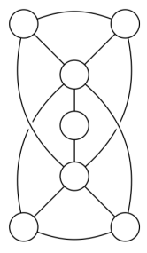
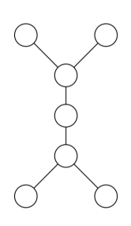
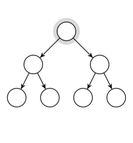
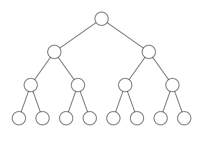
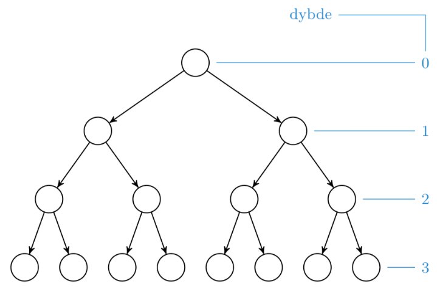
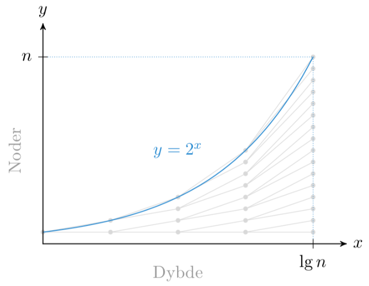
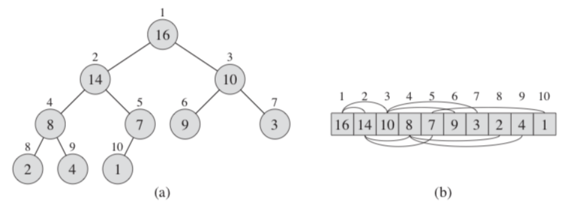
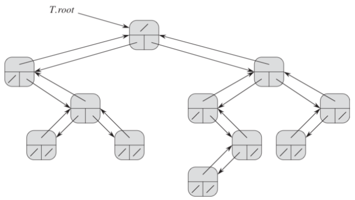
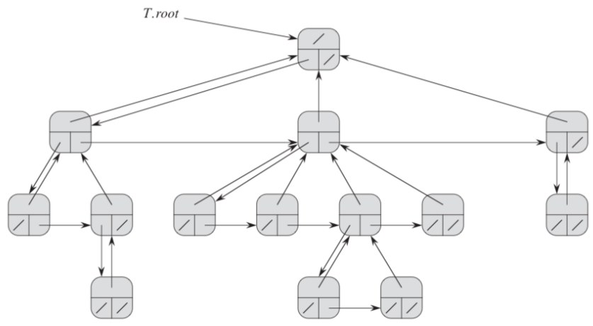
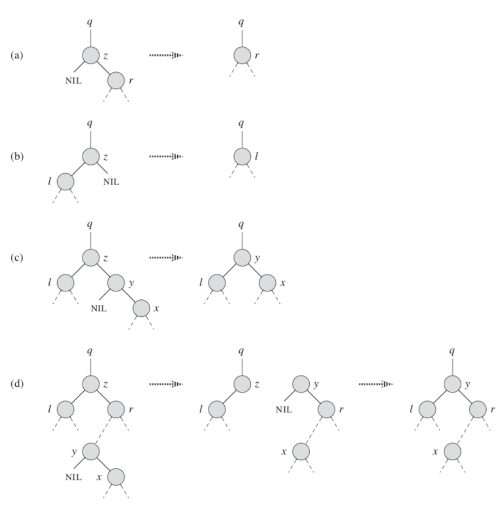

# Innhold
- [Forelesning 5 - Rotfaste trestrukturer](#forelesning-5---rotfaste-trestrukturer)
    - [Trær - forelesning](#trær---forelesning)
    - [Kapittel 6 Heapssort](#kapittel-6---heapssort)
        - [6.1 Heap = haug](#61-heap--haug)
        - [6.2 Opprettholde max-heap egenskapen](#62-opprettholde-max-heap-egenskapen)
        - [6.3 Bygge en heap (haug)](#63-bygge-en-heap-haug)
        - [6.4 Heapsort algoritmen](#64-heapsort-algoritmen)
        - [6.5 Prioritetskøer](#65-prioritetskøer)
    - [10.4 - Representasjon av rotfaste trær](#104---representasjon-av-rotfaste-trær)
    - [Kapittel 12 - Binære søketrær](#kapittel-12---binære-søketrær)
        - [12.1 Hva er et binært tre?](#121-hva-er-et-binært-tre)        
        - [12.2 Operasjoner på binært søketre](#122-operasjoner-på-binært-søketre)
        - [12.3 Innsetting og fjerning](#123-innsetting-og-fjerning)        
        - [12.4 Tilfeldig bygde binære søketrær - forelesning](#124-tilfeldig-bygde-binære-søketrær---forelesning)
# Forelesning 5 - Rotfaste trestrukturer
- Læringsmål:
    - Forstå hvordan hauger fungerer, inkl. haugegenskapen (the heap property), og hvordan de kan brukes som prioritetskøer (Parent, Left, Right, Max-Heapify, Build-Max-Heap, Heapsort, Max-Heap-Insert, Heap-Extract-Max, Heap-Increase-Key, Heap-Maximum. Tilsvarende for min-heaps.)
    - Forstå Heapsort
    - Forstå hvordan rotfaste trær kan implementeres med noder og peker (inkl. med pekere til første barn og neste søsken∗)
    - Forstå hvordan binære søketrær fungerer, inkl. binær-søketre-egenskapen (the binary-search-tree property)
        - (Inorder-Tree-Walk, Tree-Search, Iterative-Tree-Search, Tree-Minimum, TreeMaximum, Tree-Successor, Tree-Predecessor, Tree-Insert, Transplant, Tree-Delete)
    - Vite at forventet høyde for et tilfeldig binært søketre er Θ(lg n)
    - Vite at det finnes søketrær med garantert høyde på Θ(lg n)
    - Merk: Det kreves ikke grundig forståelse av Transplant og Tree-Delete.


## Trær - forelesning
- Urettet graf bestående av mengde noder/vertices $V$ og mengde kanter/edges $E$, beskrives som $G=(V,E)$
- Kant er kobling mellom pas noder $\{u,v\}$
- Grafen er syklisk, fordi det er syklisk kobling mellom nodene



- Fritt tre, sammenhengende, asyklisk, urettet graf. Har stier som kobler hvert par sammen, en kant unna usammenhengende eller syklisk.
- $|E|=|V|-1$



- Rotfast tre, ofte "rettede" grafer med rettede stier vekk fra rot. Fritt tre med angitt rotnode som ikke har foreldrenoder. I ordnet tre har barn ordning, men i posisjonstre har hvert barn posisjon.




- Komplett binærtre, hver node har to barnenoder og bunnivå er fullstendig fylt. Binærtre er posisjonstre der hver node har to barneposisjoner, kantolkes som ordnede trær med ekstra informasjon



- Dybde er antall kanter fra løv til rot. Antall noder ved dybde $x$ er gitt av $2^x$. Dybden ved bladene er $2^x=n \to x = \log(n)$. HØyde er maksimal dybde, altså dybde fra rot til blader.




- I fullt binærtre har alle interne noder to barnenoder
- I balansert binærtre har alle løvnoder/blad har ca. samme asymptotisk dybde
- I komplett binærtre har alle løvnoder/blad har nøyaktig samme dybde.

## Kapittel 6 - Heapssort
- Sorteringsalgoritme, kjøretid $O(n\log(n))$, sorterer in place
    - Kun konstant antall elementer lagres på utsiden av input array på ethvert tidspunkt
- Bruker datastrukturen heap, som lager effektiv prioritetskø 

### 6.1 Heap = haug
- En binær heap er arrayobjekt som er nesten et fullstendig binært tre
    -  Treet er fullstendig fylt, annet enn laveste nivå, som fylles fra venstre
- Hver node i treet korresponderer til element i arrayen.
- Array $A$ har to attributter: 
    - $A.length$: kan ha tomme plasser 
    - $A.heap\text{-}size$: representerer antall elementer i heap som er lagret i array (lik $A.length$ om arrayen er helt fylt)
    - Rot er $A[1]$ 



##### PARENT
- Finner index til foreldrenode, gitt av $i/2$ rundet ned
```
PARENT(i)
1 return roundDown(i/2)
```

##### LEFT
- Finner index til venstre barnenode, gitt av $2i$
```
LEFT(i)
1 return 2i
```

##### RIGHT
- Finner index til høyre barnenode, gitt av $2i+1$
```
RIGHT(i)
1 return 2i+1
```

- Har min og max heaps:
    - Max-heaps: foreldrenodene er større enn barnenodene, største elementet lagres i rot og elementverdiene reduseres nedover heap
        - $A[PARENT(i)]\geq A[i]$ (brukes i heapsort)
    - Min-heaps: foreldrenodene er mindre enn barnenodene, minste elementet lagres i rot og elementverdien økes nedover
        - $A[PARENT(i)]\leq A[i]$

### 6.2 Opprettholde max-heap egenskapen
- Bruker MAX-HEAPIFY for å opprettholde max-heap
    - Antar binære trær med rot $LEFT(i)$ og $RIGHT(i)$ er max-heap, men at $A[i]$ kan være mindre enn barnenodene
    - MAX-HEAPIFY lar $A[i]$ synke til rett plass i max-heap, så deltre med rot $i$ følger max-heap egenskapen

##### MAX-HEAPIFY
- Tar inn array $A$ og index $i$, basert på å finne index til største element av foreldrenode og barnenode
    - Finner først index til høyre og venstre barnenode. Om venstre barnenode er innenfor heap og verdi er større enn $A[i]$ settes $largest$ til å være index til venstre barnenode. 
    - Om høyre barnenode er innenfor heap og verdi er større enn $A[largest]$ settes $largest$ til å være index til høyre barnenode
    - Om $i\neq largest$ byttes $A[i]$ og $A[largest]$, og MAX-HEAPIFY
- MAX-HEAPIFY bruker $\theta(1)$ på å fikse forhold mellom elementer $A(i)$, $A[LEFT(i)]$ og $A[RIGHT(i)]$
- Antar rekursivt kall utføres på deltreet til en barnenode
- Worst-case er når bunnivået er nøyaktig halvffullt. Da er størrelsen til barnenodens deltre $2n/3$ (barnenoden man får til har største deltre som inneholder $2/3$ av nodene). Da bruker MAX-HEAPIFY $T(2n/3)$ på rekursivt tall, og får total kjøretid
$$
T(n)\leq T(2n/3)+\theta(1)
$$
Master teorem gir MAX-HEAPIFY gjøretid $T(n)=O(\log(n))$. Kan også si at kjøretiden på node med høyde $h$ er $O(h)$. Masterteorembevis:

$$
T(n) \leq T(2n/3)+\theta(1) \\
a=1, b=3/2, f(n)=\theta(1) \\
\text{Case 1: } f(n) = O(n^{\log_b(a-\epsilon)}) = O(n^{\log_{3/2}(1-\epsilon)}), \epsilon \text{ må være } -\frac{1}{2} \text{ for å få } n¹.  -\frac{1}{2} \text{ er ikke over } 0 \\
\text{Case 2: } f(n)=\theta(n^{\log_b(a)})=\theta(n^{\log_{3/2}(1)})=\theta(n⁰)=\theta(1). \text{ Derfor: } \theta(f(n)\cdot\log(n))=\theta(n)
$$

```
MAX-HEAPIFY(A,i)
 1 l = LEFT(i)
 2 r = RIGHT(i)
 3 if l <= A.heap-size and A[l] > A[i]
 4    largest = l  
 5 else largest = i
 6 if r <= A.heapsize and A[r] > A[largest]
 7    largest = r
 8 if largest != i 
 9    exchange A[i] with A[largest]
10    MAX-HEAPIFY(A, largest)
```
### 6.3 Bygge en heap (haug)
- BUILD-MAX-HEAP brukes for å lage max-heap fra ikke-ordnet inputarray $A[1,n]$, $n=A.length$. Bruker MAX-HEAPIFY fra bunnen og oppover.

##### BUILD-MAX-HEAP
- Metode tar inn matrise $A$, lager max-heap ved å fikse alle deltrær
- Setter $A.heap-size$ til å være $A.length$, så $A$ blir heap
- Starter på i = A.length/2, rundet ned. Dette er foreldrenoden til den siste noden i arrayen (lengst ned til høyre i heap)
- Array og denne index brukes som input i MAX-HEAPIFY(A,i), ig slrger fir at suste deltreet blir max-heap. For løkke går nedover for å fikse hele treet.
```
BUILD-MAX-HEAP(A)
1 A.heap-size = A.length
2 for i = roundDown(A.length/2) downto 1
3    MAX-HEAPIFY(A,i)
```

###### BUILD-MAX-HEAP bevis
- Initialisering: før første iterasjon vil $i=n/2$, rundet ned, så alle nodene $i+1, i+2,...,n$ vil være blader med størrelse 1 (allerede max heap)
- Vedlikehold: barnenodene til node $i$ har høyere index enn $i$, loop invariant gir at disse er røtter til max-heaps. Er krav for MAX-HEAPIFY, så metoden sørger for at $i$ blir rot for max-heap og at $i+1,i+2,...,n$ fortsatt er røtter før max-heaps
- Terminering: ved terminering vil $i=0$, så loop invariant gir at alle nodene $1,2,...,n$ er rot for max-heap, og derfor er hele heapen en max-heap

###### BUILD-MAX-HEAP analyse
- Hvert kall til MAX-HEAPIFY bruker $O(\log(n))$ tid, BUILD-MAX-HEAP gjør $O(n)$ slike kall. Kjøretid blir derfor $O(n\log(n))$. Er korrekt øvre grense, men ikke asymptotosik tett.
- Finner tettere grense ved å bruke at kjøretid til MAX-HEAPIFY på node avhenger av høyden til noden i treet
- Heap med $n$ elementer har $h=\log(n)$, rundet ned, og antall noder ved høyde $i$ er $n/2^i=2^h/2^i=2^{h-i}$
- Kjøretid til MAX-HEAPIFY på node ved høyde $i$ er derfor $O(i)=i$. Derfor er total kostnad per høyde $2^{h-i}\cdot i$
- Total kostnad for BUILD-MAX-HEAP, summerer kostnadene ved hver høyde i treet:
$$
T(n)=\sum_{i=0}^h 2^{h-i}\cdot i=\sum_{i=0}^h \frac{2^h}{2^i}\cdot i=2^h\sum_{i=0}^h\frac{i}{2^i}=\theta(n)\cdot \sum_{i=0}^h\frac{i}{2^i}
$$
Kan trylle litt med dette (se mer [her](gtkNotes.md))
$$
\sum_{i=0}^h\frac{i}{2^i}\leq \sum_{i=0}^\infty i\cdot(\frac{1}{2})^i=\frac{1/2}{1/4}=2=\theta(1)
$$

### 6.4 Heapsort algoritmen
- Bruker BUILD-MAX-HEAP og MAX-HEAPIFY for å sortere inputarray $A[1,n]$

##### HEAPSORT
- Metoden kaller BUILD-MAX-HEAP for å lage max-heap av $A$
- Bytter om på $A[1]$ og $A[i]$. $A[i]$ er alltid det siste elementet i $A$, da vi fjerner $A[i]$ etter vi har byttet. Derfor er alltid det største elementet sist.
- Har kjøretid: $T(n)=O(n)+O((n-1)\log(n))=O(n\log(n))$

```
HEAPSORT(A)
1 BUILD-MAX-HEAP(A)
2 for i = A.length downto 2
3    exchange A[1] with a[i]
4    A.heap-size = A.heap-size - 1
5    MAX-HEAPIFY(A,1)
```

### 6.5 Prioritetskøer
- God inplementasjon av quicksort er ofte bedre enn heapsort
- Heapsort brukes ofte for å lage effektive prioritetskøer
    - Prioritetskø er datastruktur som inneholder sett $S$ med elementer assosiert med verdi $key$, som linked-list og dynamiske tabeller
    - Max-prioritetskø er basert på max-heap
- Max-prioritetskø støtter HEAP-MAXIMUM, HEAP-EXTRACT-MAX, HEAP-INCREASE-KEY, MAX-HEAP-INSERT

##### HEAP-MAXIMUM
- Returnerer største element i $A$
- Kjøretid $\theta(1)$
```
HEAP-MAXIMUM(A)
1 return A[1]
```
##### HEAP-EXTRACT-MAX
- Tar ut max element ved å finne max, sette $A[1]$ til å være det minste elementet i $A$ (ved å sette $A[1] = A[A.heap-size]$)
- Dekrementerer $A.heap-size$ med 1
- Kjører MAX-HEAPIFY(A,1) og returnerer max
- Kjøretid $O\log(n)$
```
HEAP-EXTRACT-MAX(A)
1 if A.heap-size < 1
2    error "heap-underflow"
3 max = A[1]
4 A[1] = A[A.heap-size]
5 A.heap-size = A.heap-size - 1
6 MAX-HEAPIFY(A,1)
7 return max
```
##### HEAP-INCREASE-KEY
- Setter $A[i]=key$
- Mens $i$ er over $1$ og $A[PARENT(i)]$ er større enn $A[i]$ bytter vi $A[i]$ og $A[PARENT(i)]$, og setter $i$ til å være $i$ sin parent (runder ned $i/2$)
- Kjøretid $O(\log(n))$ (siden det er høyden)
```
HEAP-INCREASE-KEY(A,i,key)
1 if key < A[i]
2    error "new key is smaller than current key"
3 A[i] = key
4 while i > 1 and A[PARENT(i)] < A[i]
5    exchange A[i] with A[PARENT(i)]
6    i = PARENT(i)
```
##### MAX-HEAP-INSERT
- Setter inn verdi 
- Øker $A.heap-size$, og setter det nye elementet til å være $-\infty$
- Kjører HEAP-INCREASE-KEY(A,A.heap-size.key)
- Kjøretid $\theta(\log(n))$ 
```
MAX-HEAP-INSERT(A,key)
1 A.heap-size = A.heap-size + 1
2 A[A.heap-size] = -∞
3 HEAP-INCREASE-KEY(A,A.heap-size,key)
```
## 10.4 - Representasjon av rotfaste trær
- Rotfaste trær kan representeres av en lenket datastruktur
- I binære trær har noder max to barnenoder, i rotfaste trær kan noder ha fler barnenoder
- En node representeres av et objekt, antar hver node inneholder $key$. Andre attributter peker på andre noder.

#### Binære trær
- Figur viser bruk av $p,left,right$, for å lagre pekere til foreldrenoden, ventre og høyre barnenode.
- $x.p=NIL$: noden er roden
- $x.left=NIL$: noden har ikke venstre barnenode
- $x.right=NIL$: noden har ikke høyre barnenode
- $T.root$ peker alltid mot roten, så treet er tomt om $T.root=NIL$



#### Rotfaste trær med ubegrenset forgreining
- Vi erstatter $left$ og $right$ attributter med $child_1,child_2,...,child_k$ for å representere rotfast tre hvor hver node har max $k$ antall barn
- Fungerer ikke om antall barnenoder er ubegrenset, og mye plass bortkastes om $k$ er stor
- Alternativ måte er at alle barnenoder beker til foreldrenode, men foreldrenode kun peker på venstre barnenode, og den peker videre til søskennoden til høyre. 
    - Pekere mot barnenoder erstattes av $x.left-child$ og $x.right-sibling$


## Kapittel 12 - Binære søketrær
- Søketre støtter operasjonene: SEARCH, MINIMUM, MAXIMUM, PREDECESSOR, SUCCESSOR, INSERT, DELETE
- Kan brukes som ordbok og prioritetskø
- Kjøretid til grunnleggende operasjoner for binært søketre er proporsjonal med høyden av treet
- Fullstendig binærttre med $n$ noder har worst case kjøretid $\theta(\log(n))$, men tre med lineær kjede har $\theta(n)$

### 12.1 Hva er et binært tre?
- Binært søketre er ordnet i binært tre som representers med lenket datastruktur med hver node som et objekt (hver node har $key$-verdi og attributter $left$ (mot barnenode), $right$ (mot barnenode) og $p$ (mot foreldrenode))
- Binær-søketre egenskap: hvis $y$ er en node i venstre deltre til $x$ vil $y.key\leq x.key$, mens hvis $y$ er node i høyre deltre til $x$ vil $y.key>x.key$
- Binær-søketre egenskap: om $y$ er node i $x$ sitt venstre deltre er $y.key\leq x.key$. Om $y$ er node i $x$ sitt høyre deltre er $y.key>x.key$
- Binær-søketre egenskapen hjelper å skrive ut $key$-veridene i binært søketre i sortert rekkefølge via enkel rekursiv algoritme (ikke-ordnet tre traversering/inorder tree walk)

##### INORDER-TREE-WALK
- Printer $key$ verdiene i sortert i binært søketre i sortert rekkefølge
- Tar inn node $x$ og printer $key$-veridene til venstre deltre, til $x$ og til høyre deltre via rekursive kall
- Kjøretid $\theta(n)$ ($\Omega(n)$ fordi den må innom alle noder, $O(n) kan bevises ved substitusjonsmetoden$)

```
INORDER-TREE-WALK(x)
1 if x != NIL
2    INORDER-TREE-WALK(x.left)
3    print(x.key)
4    INORDER-TREE-WALK(x.right)
```


### 12.2 Operasjoner på binært søketre
- Binært søketre støtter: MINIMUM, MAXIMUM, SEARCH, SUCCESSOR, PREDECESSOR - har kjøretid $O(h)$ hvor $h$ er høyde til treet

##### TREE-SEARCH
- Tar inn peker mot rot og $key$ verdi $k$, returnerer peker mot node med $key=k$ om den eksisterer, ellers NIL. Begynner søket ved roten, returnerer noden om $x=NIL$ eller $x.key=k$ (roten har riktig verdi). Ellers sammenliknes $k$ og $x.key$, og fortsetter søket til venstre eller høyre, basert på om $k$ er større eller mindre enn $x.key$
```
TREE-SEARCH(x,k)
1 if x == NIL or k == x.key
2    return x
3 if k < x.key
4    return TREE-SEARCH(x.left,k)
5 else return TREE-SEARCH(x.right,k)
```
##### TREE-MINIMUM
- Sjekker mot venstre helt til man kommer til en node som ikke har et element til venstre
```
TREE-MINIMUM(x)
1 while x.left != NIL
2    x = x.left
3 return x
```
##### TREE-MAXIMUM
- Sjekker mot høyre helt til man kommer til en node som ikke har et element til høyre

```
TREE-MAXIMUM(x)
1 while x.right != NIL
2    x = x.right
3 return x
```
##### TREE-SUCCESSOR
- Finner neste node i sortert rekkefølge
- To scenarioer:
    - Høyre subtre til $x$ er ikke tomt, så etterfølger er minste element i subtre
    - Høyre subtre til $x$ er tomt, $x$ er største elementet i deltreet, så neste node vil være rota til $x.p$ eller $NIL$
```
TREE-SUCCESSOR(x)
1 if x.right != NIL
2    return TREE-MINIMUM(x.right)
3 y = x-p
4 while y != NIL and x == y.right
5    x = y
6    y = y.p
7 return y
```
### 12.3 Innsetting og fjerning
- Fører til at binært søketre endres, fordi datastrukturen må modifiseres så binær-søketre egenskapen fortsatt gjelder

##### TREE-INSERT
- Tar inn binært søketre $T$ og node $z$ som skal settes ved rett plass i $T$ basert på $z.key$
- Begynner ved treets rot og bruker while-loop for å finne NIL som kan erstattes med $z$
    - I hver iterasjon settes $y$ lik $x$, så den representerer forrige node. Om $z.key$ er mindre enn $x.key$ går den til venstre, ellers til høyre. Fortsetter til $x=NIL$, så $y$ er en node uten barnenoder. Lar så $y$ være foreldrenode til $z$
    - Om treet er tomt settes roten lik $z$, ellers avgjøres det om $z$ er venstre eller høyre barn til $y$
- Kjøretid: $O(h)$
```
TREE-INSERT(T,z)
 1 y = NIL
 2 x = T.root
 3 while x != NIL
 4    y = x
 5    if z.key < x.key
 6       x = x.left
 7    else x = x.right
 8 z.p = y
 9 if y == NIL
10    T.root = z   // tree T was empty
11 elseif z.key < y.key
12    y.left = z
13 else y.right = z
```
```
TRANSPLANT(T,u,v)
1 if u.p == NIL
2    T.root = v
3 elseif u == u.p.left
4    u.p.left = v
5 else u.p.right = v
6 if v != NIL
7    v.p = u.p
```
- Om du fjerner $z$ fra binært søketre må man oppdatere barnenoderpekere til $z.p$ og foreledrenodepekerne til $z.left$ og $z.right$ om $z$ har barnenoder
- Bruker algoritmen TRANSPLANT for å flytte hele deltrær. Erstatter deltreet med rot $u$ med deltre med rot $v$

```
TREE-DELETE(T,z)
 1 if z.left == NIL
 2    TRANSPLANT(T,z,z.right)
 3 elseif z.right == NIL
 4    TRANSPLANT(T,z,z.left)
 5 else y = TREE-MINIMUM(z.right)
 6    if y.p != z
 7       TRANSPLANT(T,y,y.right)
 8       y.right = z.right
 9       y.right.p = y
10    TRANSPLANT(T,z,y)
11    y.left = z.left
12    y.left.p = y
```



### 12.4 Tilfeldig bygde binære søketrær - forelesning
- Operasjoner i binære søketrær avhenger av høyde på treet, som kan variere
- Average høyde er ikke kjent når innsetting og sletting brukes for å lage tre
- Om man kun ser på innsetting er forventet høyde til tilfeldig bygd binært søketre $O(\log(n))$, så worst-case høyden er lineær. Kjøretid til operasjoner er derfor $O(\log(n))$, som bryter sorteringshastigheten
- Tilfeldig bygd betyr at $key$-verdier er satt inn i tilfeldig rekkefølge i initielt tom tre
- Bruker ofte heap istedetfor binær søketrær fordi heap er perfekt balansert og operasjonene er $O(n\log(n))$, mens binært søketre er avhengig av balansering, innsetting og sletting, som ofte tar lenger tid
- Heap brukes for min og maks, binær søketrær er bedre for å være sortert