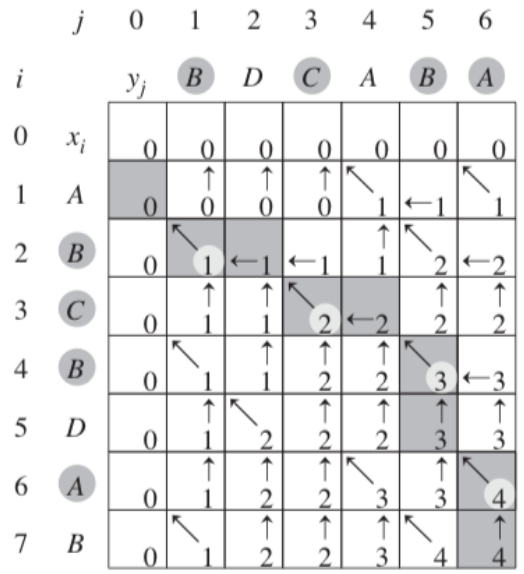

# Innhold
- [Forelesning 6 - Dynamisk programmering](#forelesning-6---dynamisk-programmering)
    - [Kapittel 15 - Dynamisk programmering](#kapittel-15---dynamisk-programmering)
        - [15.1 Stavkutting - eksempel på dynamisk programmering](#151-stavkutting---eksempel-på-dynamisk-programmering)
        - [15.3 Elementer ved dynamisk programmering](#153-elementer-ved-dynamisk-programmering)
        -[15.5 Longest Common Subsequence (LCS)](#155-longest-common-subsequence-lcs)
# Forelesning 6 - Dynamisk programmering
- Dynamisk programmering er måte å genarelisere splitt og hersk prosedyrer hvor delproblemer overlapper. Finner og lagrer del-løsninger, så vi slipper å løse dem fler ganger.
- Læringsmål:
    - Forstå ideen om en delinstansgraf
    - Forstå designmetoden dynamisk programmering
    - Forstå løsning ved memoisering (top-down)
    - Forstå løsning ved iterasjon (bottom-up)
    - Forstå hvordan man rekonstruerer en løsning fra lagrede beslutninger
    - Forstå hva optimal delstruktur er
    - Forstå hva overlappende delproblemer er 
    - Forstå eksemplene stavkapping, matrisekjede-multiplikasjon og LCS
    - Forstå løsningen på det binære ryggsekkproblemet (appendiks D i dette heftet, Knapsack, Knapsack')

## Kapittel 15 - Dynamisk programmering
- Dynamisk programmering løser problemer ved å kombinere løsninger på delproblemer
    - Brukes når delproblemer overlapper 
    - Brukes ofte på optimaliseringsproblem, som kan ha mange løsninger med ulike verdier, der vi ønsker løsning med optimal verdi (ofte min eller max)
- For å utvikle dynamisk programmeringsalgoritme:
    1. Karakteriser strukturen til optimal løsning
    2. Rekursivt definer verdien til optimal løsning
    3. Regn ut verdien til optimal løsning, vanligvis bottom-up
    4. Lag en optimal løsning fra utregnede informasjon
        Kan utlates om man kun trenger verdi til optimal løsning og ikke løsningen

### 15.1 Stavkutting - eksempel på dynamisk programmering
- Kan bruke dynamisk programmering for å bestemme beste måte å kutte stenger
- Om $i$ er lengden på stav og man antar pris $p_i$ for lengden er kjent. Eksempel:
    length $i$  |1|2|3|4|5|6|7|8|9|10
    |-----------|-|-|-|-|-|-|-|-|-|--
    |price $p_i$|1|5|8|9|10|17|17|20|24|30

##### Stavkutte-problemet
- Gitt stav av lengde $n$ og tabell med priser, $p_i$, skal vi bestemme maksimal inntekt $r_n$ man kan få ved å kutte opp stav
- Optimal løsning er å kutte stav i deler av lengde $i_1,i_2,...,i_k$ hvor $k\leq n$, så sum av delene blir $i_1+i_2+...+i_k=n$ og totalpris er $r_n=p_{i_1}+p_{i_2}+...+p_{i_k}$ maksimeres
- $r_n=\max{(p_n,r_1+r_{n-1},r_2+r_{n-2},...,r_{n-1}+r_1)}$
- Når stav kuttes i to er de uavhengige instanser av stavkutte-problemet, som kan løses hver for seg: optimal delstruktur

#### Rekursiv top-down implementasjon
- Metoden finner max-inntekt ved stavkutting vha likning $r_n=max_{1\leq i\leq n}(p_i+r_{n-1})$

##### CUT-ROD
- Bruker likning $r_n=max_{1\leq i\leq n}(p_i+r_{n-1})$, til å finne maksimal inntekt $q$ ved gitte priser i input array $p[1,n]$ og lengden $n$
- Om lengden er $0$ er total pris $0$, ellers prøver for-løkke alle mulige oppdelinger ved rekursive kall
- CUT-ROD er ineffektiv, kaller seg selv rekursivt med samme parameter (løser samme delproblem fler ganger)
- Kjøretid: $T(n)=1+\sum_{j=0}^{n-1}T(j)=2^n$
```
CUT-ROD(p,n)
1 if n == 0
2    return 0
3 q = -∞
4 for i = 1 to n
5    q = max(q,p[i]+CUT-ROD(p,n-i))
6 return q
```

#### Dynamisk programmering for optimal stavkutting
- Dynamisk programmering brukes på CUT-ROD for å gjøre den effektiv
- Må lagre tidligere løsninger, så hver kun løses en gang. Kan slå opp tidligere løsning, istedetfor å kjøre algoritme igjen.
- Større romkompleksitet, men betydelig bedre tidskompleksitet (eksponentiell til polynomial)
- To måter å implementere dynamisk programmeringsalgoritme:
    1. Top-down med memoisering: prosedyren er rekursiv, endres så den lagrer resultatet til hvert delproblem. Om prosedyre har løst delproblemet tidligere returnerer dne lagrede verdien istedetfor å regne den ut igjen.
    2. Bottom-up metode: løsningen av et delproblem avhenger kun av å løse mindre delproblem. Sorterer og løser delproblemer etter størrelse (minst først). Løsening på delproblemer lagres, så hvert delproblem løses en gang. Når et delproblem løses er allerde alle mindre delproblemer løst og lagret.
    - Har samme asymptotiske kjøretid, men bottom-up har ofte bedre konstante faktorer
    - Relativt likt rekursjon/induksjon

#### Top-down memoisering

##### MEMOIZED-CUT-ROD
- Identisk med CUT-ROD, men delløsningene lagres i array
- For-løkke fyller array med $-∞$, som fungerer som markør på at delproblemene ikke er løst før (om $r[i]\geq 0 har vi løst problemet før$)
- Kaller MEMOIZED-CUT-ROD-AUX
```
MEMOIZED-CUT-ROD(p,n)
1 let r[0,n] be new array
2 for i = 0 to n
3    r[i] = -∞
4 return MEMOIZED-CUT-ROD-AUX(p,n,r)
```
##### MEMOIZED-CUR-ROD-AUX
- Metoden finner max inntekt ved stavkutting med lengde $n$ og priser $p[1,n]$
- Om problemet allerde er løst for $n$ returneres løsningen lagret i $r[n]$
- Om lengden er $0$ er inntekten $0$
- Ellers må man finne løsning
- Beste løsning lagres ved $r[j]$ 
```
MEMOIZED-CUT-ROD-AUX(p,n,r)
1 if r[n] >= 0
2    return r[n]
3 if n == 0
4    q = 0
5 else q = -∞
6    for i = 1 to n
7       q = max(q,p[i]+MEMOIZED-CUT-ROD-AUX(p,n-i,r))
8 r[n] = q
9 return q
```

#### Bottom-up metode
- Metoden baserer seg på iterasjon istedetfor rekusjon


##### BOTTOM-UP-CUT-ROD
- Metoden finner maksimert inntekt ved stavkutting med lengde $n$ og priser $p[1,n]$
- Bruker naturlig rekkefølge til delproblemene (delproblem av størrelse $i$ er mindre enn av størrelse $j$ dersom $i<j$)
- Løsninger lagres i $r[0,n]$ hvor $r[i]$ er maksimal fortjeneste ved lengde $i$
```
BOTTOM-UP-CUT-ROD(p,n)
1 let r[0,n] be a new array
2 r[0] = 0
3 for j = 1 to n
4    q = -∞
5    for i = 1 to j
6       q = max(q, p[i]+r[j-i])
7    r[j] = q
8 return r[n]
```
#### Average analyse av bottom-up og top-down
- Både top-down og bottom-up metodene lagrer løsningene på delproblemene. 
- Top-down memoisering sjekker om løsning er lagret før rekursivt kall, bottom-up løser delproblemer fra bunnen av og bruker lagrede resultat for å løse delproblem
- Begge har kjøretid $\theta(n²)$ 
    - Bottom-up har dobbel for-løkke, topdown har $n$ delproblemer som løses ved $n$ iterasjoner

#### Rekonstruering av en løsning
- Algoritmene returnerer verdi til optimal løsning, men ikke faktisk løsning (liste av lengder stav kuttes til). Må også lagre valget som fører til optimal løsning for å gjøre dette.

##### EXTENDED-BOTTOM-UP-CUT-ROD
- Metode finner optimal inntekt og opptimal lengde ved stavkutting
- Identist med BOTTOM-UP-CUT-ROD, men lagrer array $s[0,n]$ som lagrer optimale størrelsen $i$ på første del som kuttes når man løser delproblem $j$. 
```
EXTENDED-BOTTOM-UP-CUT-ROD(p,n)
 1 let r[0,n] and s[0,n] be new arrays
 2 r[0] = 0
 3 for j = 1 to n
 4    q = -∞
 5    for i = 1 to j
 6       if q < p[i] + r[j-1]
 7          q = p[i] + r[j-i]
 8          s[j] = i
 9    r[j] = q
10 return r and s 
```

### 15.3 Elementer ved dynamisk programmering 
- To krav for å bryke dynamisk programmering: optimal delstuktur og overlappende delproblemer
- Steg for å utvikle dynamisk programmeringsalgoritme:
    1. Karakteriser struktur for optimal løsning - er det optimal delstruktur
    2. Rekursivt definer verdien til en optimal løsning
    3. Regn ut verdien til optimal løsning (vanligvis bottom-up)
    4. Lag optimal løsning fra utregnet informasjon

#### Optimal delstruktur
- Problem har optimal delstruktur om optimal løsning på problemet baseres på optimale løsninger på delproblemene
- Følg mønster for å se etter optimal delstruktur:
    1. Vis at løsning på problemet innebærer valg (som å velge initielt kutt på stav), som etterlater en eller fler delproblemer å løse
    2. Anta at for problem blir man gitt malget som fører til optimal løsning
    3. Gitt valget, bestem hvilke delproblem som følger og hvordan man best karakteriserer resulterende rom av delproblem
    4. Vis at løsninger på delproblemene innenfor optimal løsning må være optimale ved "klipp og lim" teknikk
- Variasjon i optimal delstruktur har to faktorer: totalt antall delproblemer og antall valg per delnode
- Kjøretid til dynamisk programmeringsalgoritme avhenger av produktet av faktorene  
- Grådig algoritme: dynamisk programmeringsalgoritme finner optimal løsning på delproblem og ta informert valg, grådig algoritme utfører grådig valg som ser best ut, og løser resulterende delproblemer
- To problemer for rettet graf $G=(V,E)$ og vertekser $u,v\in V$. En har optimal delstruktur, andre ikke:
    1. Ikke vektet kortest bane: finner bane fra $u$ til $v$ som består av færrest mulig kanter. Bane må være enkel, siden å fjerne syklus fra bane vil gi bane med færre kanter (enkel = samme verteks blir ikke valgt fler ganger). Problemet har optimal delstruktur:
        - Dersom $u\neq v$ vil alle baner $p$ fra $u$ til $v$ deles inn i $u\to^{p_1}w$ og $w\to^{p_2}v$, og antall kanter i $p$ er summen av antall kanter i $p_1$ og $p_2$.
        - Påstår at om $p$ er optimal (kortest) bane fra $u$ til $v$ vil $p_1$ være optimal bane fra $u$ til $w$. 
        - Kan bevises med klipp og lim argument argument: antar $p$ er optimal og $p_1$ er ikke-optimal. Finnes delbane $p_1'$ som er optimal (kortere enn $p_1$). Om man klipper ut $p_1$ og limer inn $p_1'$ og får banen $u\to^{p_1'}w\to^{p_2} v$, som er kortere enn $p$ og motsier at $p$ er optimal. Derfor må $p_1$ være optimal delstruktur når $p$ er det. Samme gjelder $p_2$
        - Derfor har problemet optimal delstruktur, så vi kan finne korteste bane fra $u$ til $v$ ved å velge $w$ og delbanene $u\to w$ og $w\to v$ slit at disse er kortest mulig
    2. Ikke-vektet lengste bane: finn enkel bane fra $u$ til $v$ som består av flest mulig kanter. Må ha enkel bane, fordi den ellers kan traversere i syklus så baner blir $\infty$. Har ikke optimal delstruktur.
        - Ser på bane $q\to r\to t$ som er lengste, enkle bane fra $q$ til $t$. Ser at $q\to r$ vil ikke være lengst bane fra $q\to r$, for det er $q\to s\to\ r$. Viser at om $p$ er optimal bane (lengst) fra $u$ til $v$, vil ikke alltid $p_1$ være en optimal delbane fra $u$ til $w$.
        - Årsak er at delproblemene for å finne lengste enkle bane ikke er uavhengige. Løsningen på et delproblem påvirker løsningen til et annet delproblem av samme problemet. 
            - Problemet av å finne lengste enkle bane fra $q$ til $t$ deles inn i to delproblem: finne lenste enkle bane fra $q$ til $r$ og fra $r$ til $t$. Første delproblem vil ha løsning $q\to s\to t\to r$. Har valgt $s$ og $t$, kan ikke lenger bruke løsningene på andre delproblemet for da har vi ikke enkel bane. Derfor finnes ikke løsning på problemet.

#### Overlappende delproblem
- Rommet av delproblem må være lite så en rekursiv algoritme vil løse samme delproblem fler ganger, istedetfor å alltid generere nye delproblemer
- Bruker dynamisk programmering når den rekursive algoritmen besøker samme problem fler ganger, så optimaliseringsproblemet har overlappende delproblemer
- Bruker splitt og hersk når rekursiv algoritme genererer nye delproblem ved hvert steg av rekursjon
- Dynamisk programmering utnytter overlappende delproblem ved å lagre løsning så den hentes frem ved konstant tid ved behov
- Vanlig tilfelle med overlappende delproblem er når algoritme gjentatt bruker løsningen på mindre dleproblem for å finne løsningen på større delproblemer

#### Rekonstruksjon av en optimal løsning
- Om man skal finne optimal løsning må den rekonstrueres fra optimal verdi vi har finnet (tar lang tid). Kan spare tid ved å lagre valg som gjøres ved optimal verdi i array underveis, så slipper man rekonstruering

#### Memoisering
- Alternativ tilnærming til dynamisk programmering er dop-down rekursiv strategi med memoisering, altså at løsninger lagres underveis
- Memoisert rekursiv algoritme har array som lagrer løsningene til hvert delproblem
- Om algoritmen møtes samme delproblem senere søker den opp løsning. Verdier initialiseres som $\pm\infty$
- Om alle delproblem må løses en gang er ofte bottom-up bedre enn top town. Om ikke alle delproblem må løses er ofte top-down memoisering bedre enn bottom up.

### 15.5 Longest Common Subsequence (LCS)
- DNA kan representeres som streng hvor hver base gis av forbokstav: $\{\text{A,G,C,T}\}$
- DNA 1: $S_1=ACCGAAA$, DNA 2: $S_2=ATCCTAG$
- Måte å finne likhet mellom DNA er å lage $S_3=ACCG$, som er likhet mellom $S_1$ og $S_2$. Jo lenger $S_3$ er, jo likere er $S_1$ og $S_2$. De like elementene trenger ikke være på samme plass eller etter hverandre, men index må være lik.

#### Steg 1 - karakteriserer strukturen til LCS
- LCS har optimal delstruktur (hvis siste elementer i $X$ og $Y$ er like, er elementet inkludert i LCS)
- Kan fjerne siste elementet fra $X$ og $Y$ og finne LCS for gjenværende sekvenser, $X_{m-1}$ og $Y_{n-1}$
- Om de siste elementene er ulike, inneholder ikke LCS begge, og må finne største LCS ved å fjerne siste element fra $X$ eller $Y$

#### Steg 2 - En rekursiv løsning for lengden til LCS
- Må enten undersøke et eller to delproblemer
    - $x_m=y_n$: løser et delproblem, finne LCS til $X_{m-1}$ og $Y_{n-1}$, siden $x_m=y_n$ festes til LCS for å finne LCS til $X$ og $Y$
    - $x_m\neq y_n$: løser to delproblem, finne LCS til $X_{m-1}$ og $Y$ og finne en LCS til $X$ og $Y_{n-1}$. Den lengste er LCS.
    - Delproblemer overlapper. Finne LCS til $X_{m-1}$ og $Y$ og $X$ og $Y_{n-1} inkluderer deldelproblemer av å finne LCS til $X_{m-1}$ og $Y_{n-1}$
    - Lar $c[i,j]$ være lengden til LCS av sekvensene $X_i$ og $Y_j$. Optimal delstruktur til LCS problemet gir rekursiv løsning:

    $$
    c[i,j] = \begin{cases} 
    0 & \text{hvis } i = 0 \text{ eller } j = 0 \\
    c[i-1, j-1] + 1 & \text{hvis } i,j > 0 \text{ og } x_i = y_j \\
    \max(c[i,j-1], c[i-1,j]) & \text{hvis } i,j > 0 \text{ og } x_i \neq y_j 
    \end{cases}
    $$


#### Steg 3 - regne ut lengden til LCS
LCS problemet har kun $\theta(mn)$ distinkte delproblemer, kan bruke dynamisk programmering for å finne løsning

##### LCS-LENGTH
- Fremgangsmåte (uten pseudokode): 
    - Tegn en matrise, $M$ på størrelse $X.length+1\cdot Y.length+1$. Den må ha plass til tall og pil. Denne er nullindexert.
    - Fyll inn 0 i første kolonne og rad
    - Skriv opp $X$ og $Y$ på siden
    - Begynn på $X[1]$ og $Y[1]$. Om $X[1]=Y[1]$, sett $M[1,1]$ til å være $M[1-1, 1-1] + 1$, og ha pilen "↖". Ellers settes $M[1,1]$ til å være det største av $M[1-1,1]$ og $M[1,1-1]$, og sett pilen til å peke på den største. Om de er like store, sett "↑". 
    - Gå videre med $X[1]$ og $Y[2]$, $Y[3]$, osv, til du har gått igjennom alle $Y[i]$ på $X[1]$. Gå deretter til $X[2]$, og repeter prosessen.
- Pseudokode har kjøretid $\theta(mn)$
- LCS vil ha rekkefølgen til alle "↖", startet fra nederst i høyre hjørne



```
LCS-LENGTH(X,Y)
 1 m = X.length
 2 n = Y.length
 3 let b[1..m,1..n] and c[0..m,0..n] be new talbes
 4 for i = 1 to m
 5    c[i,0] = 0
 6 for i = 1 to m
 7    c[0,i] = 0
 8 for i = 1 to m
 9    for j = 1 to n
10       if x_i == y_j
11          c[i,j] = c[i-1,j-1] + 1
12          b[i,j] = "↖"
13       elseif c[i-1,j] >= c[i,j-1]
14          c[i,j] = c[i-1,j] 
15          b[i,j] = "↑"
16       else c[i,j] = c[i-1,j-1] + 1
17          b[i,j] = "←"
18 
```

#### Steg 4 - rekonstruere en LCS
- Tabell hjelper konstruere LCS for $X$ og $Y$ (finne elementene i LCS og ikke bare lengden til LCS)
- LCS vil ha rekkefølgen til alle "↖", startet fra nederst i høyre hjørne

## Appendix D - Ryggsekkproblemet
- Har to versjoner av ryggsekkproblemet (knapsackproblem)
- Tyv raner butikk og finner $n$ varer. $i$-ende vare er verdt $v_i$ kroner og veier $w_i$ gram. Tyv vil ha så mye verdi som mulig, men ryggsekk bærer kun $W$ gram.
- Fraksjonell versjon: lett å løse, ser på kilopris. Tar så mye som mulig av dyreste gjenstand, og fortsetter ned lista til ryggsekk er full.
- Binær versjon er vanskeligere: kan kun ta hel gjenstand eller la ligge  
    - Også kalt 0-1 versjonen, hvor 0 er la ligge, 1 er ta med
- Løsning av binær versjon:
    - Dekomponering basert på ja-nei-spørsmål. "Skal vi ta med gjenstand $i$?"
    - Samme om man svarer ja eller nei har man delproblem, som løses rekursivt
    - Tenker vi er på siste trinn og har $1,2,...,i$ gjenstander tilgjengelig
    - Har alternativene:
        - Ja, ta med gjenstand $i$: løser deretter problemet for gjenstander $1,2,...,i-1$, hvor ryggsekkens kapasitet er redusert med $w_i$, og legger til $v_i$
        - Nei, tar ikke med gjenstand $i$: løser problemet for gjenstander $1,2,...,i-1$ men har fortsatt hele kapasiteten, og legger ikke til $v_i$

#### Rekursiv løsning av KNAPSACK
##### KNAPSACK
- Metoden tar inn største verdien tyv kan ta
    - Om antall varer er 0, kan ikke tyv ta noe
    - Lar ellers x være maksimal verdi fra andre varer, ved å ikke velge $n$
    - Om vekt av $n$ er større enn vekt til ryggsekk, velger vi $x$
    - Lar $y$ være maksimal vekt av andre varer ved å velge vare $n$
    - Returnerer max av $x$ og $y$
    - Kjøretid er eksponentiell, da antall rekursive kall vokser ekspnentielt siden det er to valg per kall
```
KNAPSACK(n,W)
1 if n == 0
2    return 0
3 x = KNAPSACK(n-1,W)
4 if W < w_n
5    return x 
6 else y = KNAPSACK(n-1,W-w_n) + v_n
7    return max(x,y)
```

#### Oppgave 6.2-3 Dynamisk programmering av KNAPSACK
- Bruker dynamisk programmering for å redusere kjøretiden. Kan bruke memoisering eller iterativ bottom-up løsning

##### KNAPSACK'
- Bottom up løsning på ryggsekkproblemet
- Metoden returnerer den største verien tyven kan ta, og lagrer delløsninger i tabell $K$
    - $K[i,j]$ gir maksimal verdi som kan oppnås for varene $1,2,...,j$ ved kapasitet $j$
- Begynner med å bestemme $0$-verdiene, siden det er bottom-up
    - For hver kapasitet settes verdien lik $0$ når det er ingen objekter
- Løser deretter delproblemene fra bunn og opp
    - Dobbel for-løkkegår gjennom alle varer og kapasiteter fra bunnen
    - $x$ settes lik total verdi om $i$ ikke velges
    - Om vekten til $i$ er større enn kapasiteten, settes $K[i,j]$ settes lik $x$ fordi det ikke er kapasitet itl å velge vare $i$. Ellers settes $y$ lik total verdi når $i$ velges, og $K[i,j]$ settes til max av $x$ og $y$

```
KNAPSACK(n,W)
 1 let K[0..n,0..W] be new array
 2 for j = 0 to W
 3    K[0,j] = 0
 4 for i = 1 to n
 5    for j = 0 to W
 6       x = K[i-1,j]
 7       if j < w_i
 8          K[i,j] = x
 9       else y = K[i-1,j-w_i] + v_i
10          K[i,j] = max(x,y)
```

#### Men, dette er ikke polynomisk
- Er NP-hardt problem
- $T(n,m)=\theta(n2^m)$