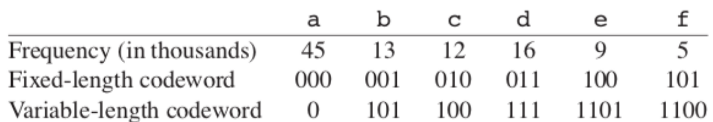
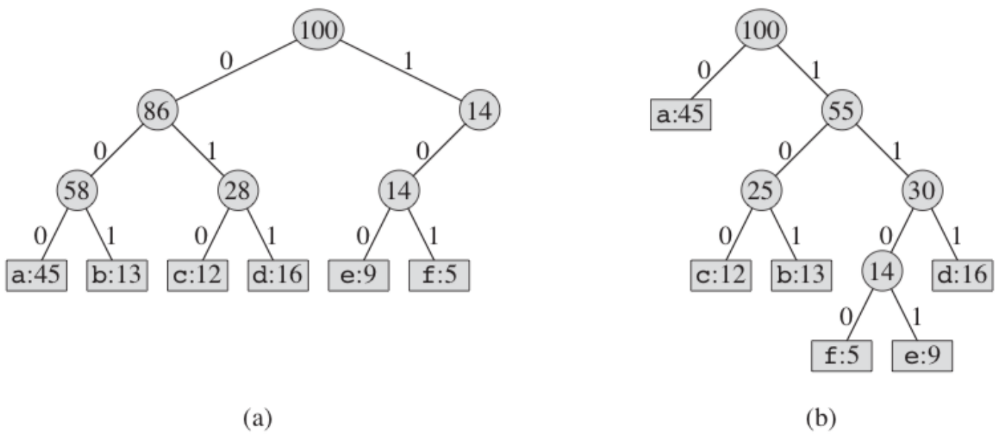
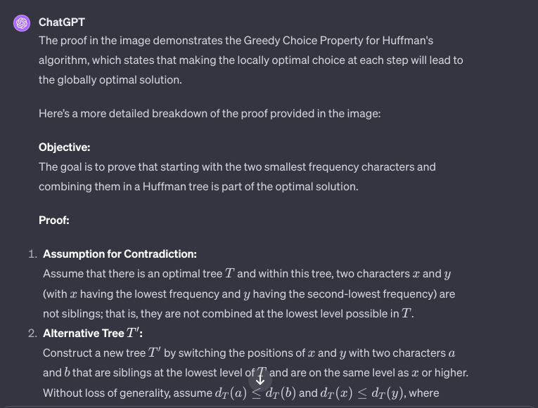
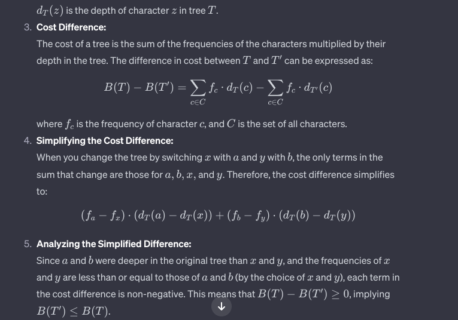
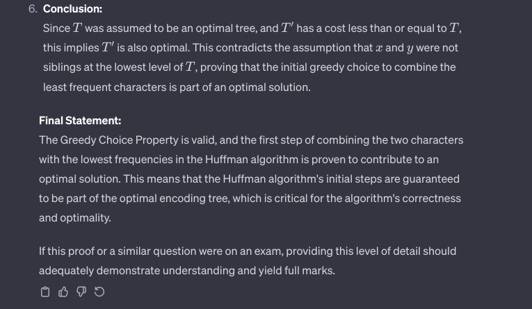

# Innhold
- [Forelesning 7 - Grådige algoritmer](#forelesning-7---grådige-algoritmer)
    - [Kapittel 16 - Grådige algoritmer](#kapittel-16---grådige-algoritmer)
        - [16.1 Aktivitet-utvelgelse problem](#161-aktivitet-utvelgelse-problem)
        - [16.2 Elementer ved den grådige algoritmen](#162-elementer-ved-den-grådige-algoritmen)
        - [16.3 Huffman koder](#163-huffman-koder)

# Forelesning 7 - Grådige algoritmer
- Grådig algoritme består av serie valg, hvor hvert valg tas lokalt
- Algoritme gjør det som ser best ut her og nå, uten større perspektiv
- Læringsmål:
    - Forstå designmetoden grådighet
    - Forstå grådighetsegenskapen (the greedy-choice property)
    - Forstå eksemplene aktivitet-utvelgelse og det freksjonelle ryggsekkproblemet
    - Forstå HUFFMAN og Huffman-koder

## Kapittel 16 - Grådige algoritmer
- For mange optimaliseringsproblem vil dynamisk programmering være for mye, bedre å bruke enklere og mer effektiv algoritme
- Grådig algoritme vil gjøre lokalt optimalt valg, det som ser best ut i øyeblikket
- Ikke alle algoritmer kan være grådige

### 16.1 Aktivitet-utvelgelse problem
- Anta sett $S={a_1,a_2,...,a_n}$ med $n$ aktiviteter som krever eksklusiv bruk av felles ressurs (feks forelesningssal). Hver aktivitet $a_i$ har starttid $s_i$ og sluttid $f_i$, der $0\leq s_1 < f_i < \infty$ (har tidsintervallet $[s_i, f_i)$).
- Aktiviteter er kompatible om tidsintervall ikke overlapper.
- I aktivitet-utvelgelse problem skal man velge størst mulig subsett av gjensidig kompatible aktiviteter. Antar aktivitetene er ordnet i sluttidens økende rekkefølge

#### Den optimale delstrukturen
- Aktivitet-utvelgelse problemet har optimal delstruktur
- $S_{ij}$ er settet av aktiviteter som starter etter aktivitet $a_i$ og før $a_j$
- Tar utgangspunkt i $S_ {ij}$ og antar at max sett av kompatible aktiviteter er $A_{ij}$, som inkluderer en aktivitet $a_k$. Ved å inkludere $a_k$ får man to delprobemer:
    1. Finne kompatible aktiviteter i $S_{ik}$ betegnet som $A_{ik}$
    2. Finne kompatible aktiviteter i $S_{jk}$ betegnet som $A_{kj}$
- $A_ik$ inneholder aktivitetene fra $A_{ij}$ som slutter før $a_k$ starter, og $A_{kj}$ inneholder aktivitetene fra $A_{ij}$ som starter etter $a_k$ slutter: $A_{ij}=A_{ik} \cup {a_k} \cup A_{kj}$
- Antall kompatible aktiviteter i $S_{ij}$ er maksimalt $|A_{ij}|=|A_{ik}|+1+|A_{kj}|$
- "Klipp og lim" brukes for å vise at om $A_{ij}$ er optimal løsning, må $A_{ik}$ og $A_{jk}$ være optimale løsninger på de to delproblemene $S_{ik}$ $S_{kj}$
- Om det finnes bedre løsning for $S_{kj}$ så $|A'_{kj}|>|A_{kj}|$, vil $S_{ij}$ inneholde $|A_{ik}|+1+|A_{kj}'|>|A_{ik}|+1+|A_{kj}|=|A_{ij}|$ kompatible aktiviteter, som er motsigelse på antagelse om at $A_{ij}$ er maksimum sett kompatible aktiviteter. 
- Har derfor at om $A_{ij}$ er optimal løsning, må $A_{ik}$ og $A_{kj}$ være optimale løsninger, og problemet har optimal delstruktur
- Har:
    $$
    c[i,j] = \begin{cases} 
    0 & S_{ij} = Ø \\
    \max_{a_k\in S_{ij}}(c[i,k]+c[k,j]+1) & S_{ij}\neq Ø
    \end{cases}
    $$


#### Å gjøre et grådig valg
- Grådig valg i aktivitet-utvelgelse problem er å legge til en aktivitet til optimal løsning før alle delproblemene er løst (alltid være aktiviteten med tidligst sluttid)
- Vil deretter gjøre det samme med delproblemet etter første delproblem er løst
- Grådige algoritmer bruker ofte top-down design

#### En rekursiv grådig algoritme


##### REC-ACT-SEL
- Rekursiv, grådig løsning av aktivitet-utvelgelse
- Metoden tar tidsintervaller $[s_1,f_1),...,[s_n,f_n)$, index $k$ som definerer delproblemet $S_k$, størrelsen $n$ til originale problemet
- Delproblemet $S_k$ går ut på å finne aktiviteter som starter etter $a_k$ slutter
- Metoden returnerer største mulige sett av kompatible aktiviteter (aktiviteter som ikke overlapper)
- Antar tidsintervallende er sortert etter økende sluttid
- Bruker $k=0$ for å løse hele problemet, legger til fiktiv aktivitet $a_0$ som har $f_0=0$
- $m$ settes lik $k+1$, så vi ser aktiviteten som kommer etter $a_k$
- While-løkken ser på neste aktivitet (mens det er fler igjen), helt til $a_m$ starter etter $a_k$
- Finner aktivitet $a_m$ som starter etter $a_k$, eller så er vi tomme for aktiviteter
    - Om vi finner aktivitet må vi finne resten av løsningen rekursivt, kombinere med $a_m$
    - Om vi er tom for aktiviteter returneres tomt sett
- Kjøretid $\theta(m)$

```
REC-ACT-SEL(s,f,k,n)
1 m = k+1
2 while m <= n and s[m] < f[k]
3    m = m+1
4 if m <= n
5    S = REC-ACT-SEL(s,f,m,n)
6    return {a_m} U S
7 else return Ø
```

#### En iterativ grådig algoritme
- Iterativ algoritme er begydelig enklere enn rekursiv

##### GREEDY-ACTIVITY-SELECTOR
- Algoritmen tar inn tidsintervaller $[s_1,f_1),...,[s_n,f_n)$ og returnerer største sett av kompatible aktiviteter
- Antall aktiviteter settes til antall startverdier, grådig algoritme begynner å velge første element $a_1$ som del av optimal løsning
- Går gjennom alle aktivitetene. Om aktivitet $a_m$ begynner etter aktivitet $a_k$, som sist ble lagt til i $A$, legges $a_m$ til optimal løsning
- Returnerer $A$ som inneholder størst mulig sett av kompatible aktiviteter
- Kjøretid $\theta(n)$
```
GREEDY-ACTIVITY-SELECTOR(s,f)
1 n = s.length
2 A = {a_1}
3 k = 1
4 for m = 2 to n
5    if s[m] >= f[k]
6       A = A U {a_m}
7       k = m
8 return A
```
#### Bevis av resultat fra grådig algoritme
- Må vise at grådighet er minst like bra som andre algoritmer for hvert trinn (at den gir optimal løsning)
- Kan bruke induksjon for å vise at siste sluttidspunkt i grådig aktivitetsutvalg er minst like tidlig som enhver annen løsning

### 16.2 Elementer ved den grådige algoritmen
- En grådig algoritme finner optimal løsning på problem ved å gjøre sekvens av valg
- Ved hvert avgjøringspunkt vil algoritmen gjøre valget som virker best i øyeblikket
- Deler opp instans i delinstanser og løser mest lovende
- Grådig algoritme har steg:
    1. Vis at problemet har optimal delstruktur
    2. Utvikle en rekursiv løsning
    3. Vis at et grådig valg vil føre til at et delproblem står igjen
    4. Vis at det alltid er trygt å ta et grådig valg
    5. Lag en rekursiv algoritme som implementerer den grådige strategien
    6. Omform rekursiv algoritme til iterativ logaritme
- Grådig algoritme kan designes slik:
    1. Skriv optimaliseringsproblemet på formen der vi gjør et valg og står igjen med et delproblem som må løses
    2. Vis at det alltid finnes en optimal løsning på originalt problem som gjør det grådige valget, slik at det grådige valget er trygt
    3. Bevis optimal delstruktur ved å vise at det grådige valget vil etterlate et delproblem, så en optimal løsning på problemet kombinert med det grådige valget vil gi en optimal løsning på det originale problemet
- Må vise at problemet har grådighetsegenskapen og optimal delstruktur

#### Grådighetsegenskapen
- Grådighetsegenskap er å lage global optimal løsning ved å gjøre lokale, optimale/grådige valg
- Egenskapen beskriver at første grådige valg er trygt, ikke at vi kan fotsette å være grådige
- Valg kan avhenge av valg som har blitt gjort frem til nå, men ikke av senere valg
- Viktig å bevise at grådig valg ved vært steg fører til global optimal løsning
    - Gjøres ved å se på global løsning som delproblem og vise at vi her har et grådig valg, som fører til et tilsvarende delproblem

#### Optimal delstruktur
- Problem har optimal delstruktur om en optimal løsning på problemet inneholder optimale løsninger på delproblemene
- Ved grådige algoritmer vises det at optimal løsning på delproblemet kombinert med grådige valget, gir optimal løsning på originalt problem
- Kan bruke induksjon for å vise at grådig valg ved hvert steg gir optimal løsning

#### Grådig vs dynamisk programmering - ryggsekkproblemet
- To klassiske optimaliseringsproblem for å illustrere forskjell mellom grådig og dynamisk programmering
- Dynamisk programmering kan brukes på fraksjonell ryggsekkproblem, ikke binært ryggsekkproblem
- Generelt funker ikke grådige algoritmer i situasjoner hvor man må sammenlikne løsningen når elementet blir inkludert med løsningen til delproblemet når elementet blir ekskludert

### 16.3 Huffman koder
- Huffman koder brukes for å komprimere data
- Huffmans grådige algoritme bruker tabell over frekvensen til en karakter for å lage optimal måte å representere hver karakter som binærstreng
- Måte å representere en fil med ulike karakterer er binær karakterkode, hvor hver karakter representeres av en unik binærstreng (kalt kodeord). Har to typer:
    - Fast-lengde kode: for å representere 6 karakterer trenger vi 4 bits ($a=000,b=001,c=010,d=011,e=100,f=101$)
    - Variert-lengde kode (optimal kode): karakter med høy frekvens for kort kodeord (få bits), mens karakter med lav frekvens får lenger kodeord. Om man kanger frekvens med antall bits per kodeord, finner vi at kode krever $(45\cdot 1+13\cdot 3+12\cdot 3+\16\cdot 3 + 9\cdot 4+5\cdot 4)\cdot 1000=224400\text{ bits}\$
        - Ganger med 1000 fordi frekvens er "in thousands"



#### Prefikskoder
- I prefikskode er ingen av kodeordene prefiks for annet kodeord.
    - $\{9,55\}$ er prefikskode, men ikke $\{9,5,55,59\}$, for $5$ er prefiks for $55$ og $59$
- $0101100=0\cdot101\cdot100=abc$. Entydog fordi ingen kodeord er prefiks for annet kodeord, så kan ikke misforså
- For å oversette fil finner vi først første kodeord, oversetter det, så neste kodeord
- Kodeord kan representeres av binærtre, hvor bladene er gitte karakterer
    - Finner kodeordet (feks 101) til karakter (feks b) ved å bevege oss nedover rota. 0 betyr velg venstre barn, 1 betyr velg høyre barn.
- Bilde: venstre (a) er fast-lengde tre, høyre (b) er optimal prefikskode



- Om man ser på fullstendig binærtre, lar $C$ være alfabetet som karakterene hentes fra og alle frekvensene er positive, vil optimal prefikskode ha nøyaktig $|C|$ blader (en for hver karakter) og nøyaktig $|C|-1$ interne noder. Antall bits for å kode en fil er:

$$
B(T)=\sum_{c\in C}c.freq\cdot d_T(c)
$$

- hvor $c$ er karakter fra $C$, $c.freq$ er frekvensen og $d_t$ er dybden til bladet der $c$ befinner seg, altså antall bits i kodeordet. $B(T)$ blir kalt kostnaden til treet $T$

#### Produksjon av Huffman koden
- Huffman algoritmen er grådig algoritme som lager optimal prefikskode, som kalles Huffman kode
- Optimal prefikskode er kodeord som representerer en karakter, har variabel-lengde og følger prefikskode egenskapen
- Algoritmen bygger binærtre, ved å begynne med sett av $|C|$ blader og utføre $|C|-1$ fusjoneringsoperasjoner

##### HUFFMAN
- Vil lage en Huffman kode
- Metode tar inn $C$ som er et sett med $n$ karakterer, hvor hver karakter $c\in C$ er et objekt med egenskapen $c.freq$
- Linje 2: initialiserer min-prioriteringskø $Q$ basert på frekvens til objektene
- For-løkken henter to noder, $x$ og $y$, som har lavest frekvens, og erstatter dem med ny node $z$, som er foreldrenoden
- Bruker EXTRACT-MIN for å hente ut venstre eller høyde barn (vilkårlig rekkefølge, for det spiller ikke noe rolle om karakter med frekvens har venstre eller høyre barn, siden begge har samme lengde)
- Node $z$ er nytt objekt til prioritetslø, finner frekvensen til $z$ ved å smmere frekvensen til $x$ og $y$. $z$ kan fusjoneres videre med andre karakterer.
- Prosedyren gjentas til det kun er en node i $Q$, nemlig rota til treet som blir returnert
- Kjøretid: $O(n\log(n))$, da det tar $O(n)$ tid å bigge min-heap og forløkken bruker $O(n\log(n))$ tid.

```
HUFFMAN(C)
1 n = |C|
2 Q = C
3 for i = 1 to n-1
4    allocate a new node z
5    z.left = x = EXTRACT-MIN(Q)
6    z.right = y = EXTRACT-MIN(Q)
7    z.freq = x.freq + y.freq
8    INSERT(Q,z)
9 return EXTRACT-MIN(Q)   // return the root of the tree
```

#### Korrekthet til Huffmans algoritme
- Må vise at problemet ved å bestemme optimal orefikskode har grådighetsegenskapen og optimal delstruktur

##### Grådighetsegenskapen
- Må vise at vi får optimal løsning om vi begynner å slå sammen to objekter med lavest frekvens. Om $x$ og $y$ er to karakterer i $C$ med lavest frekvenst ($x.f$ og $y.f$) vil det eksistere optimal prefikskode for $C$ der kodeordene for $x$ og $y$ har samme lengde, og siste biten er eneste forskjell (samme foreldrenode $z$)
- Beviser ved å ta utgangspunkt i binærtre $T$ som representerer optimal prefikskode og modifiserer så det blir en annen optimal prefikskode der $x$ og $y$ er søskennoder på maksimum dybde. Om slik tre finnes er utsagnet over bevist
- Lar $a$ og $b$ være to karakterer som er søsken ved maksimum dybde i $T$. Siden $x$ og $y$ har lavest frekvens vil $x.freq\leq a.freq$ og $y.freq\leq b.freq$. Kan se på figur at vi vil lage treet $T'$ ved å bytte $a$ og $x$, og lager treet $T''$ ved å bytte $b$ og $y$. I $T''$ er $x$ og $y$ søsken ved maksimum dybde, så må vise at dette fortsatt er optimal løsning. Forskjell i kostnad blir:
$$
\begin{align*}
B(T)-B(T')&=\sum_{c\in C}c.f\cdot d_T(c)-\sum_{c\in C}c.f\cdot d_{T'}(c)\\
&= x.f\cdot d_T(x)+a.f\cdot d_T(a)-x.f\cdot d_{T'}(x)-a.f\cdot d_{T'}(a)\\
&=x.f\cdot d_T(x)+a.f\cdot d_T(a)-x.f\cdot d_{T}(a)-a.f\cdot d_{T}(x)
&=(a.f-x.f)(d_T(a)-d_T(x))
&\geq 0
\end{align*}
$$

- Da både $(a.f-x.f)\geq 0$ og $d_T(a)-d_T(x)\geq 0$. Kostnaden $B(T')\leq B(T)$
- Samme gjelder for bytte av $y$ og $b$: $B(T'')\leq B(T)$
- Siden $T$ er optimal, må $T''$ være optimal prefikskode $(B(T'')=B(T))$
- Har bevist at vi forsatt får optimal løsning om vi begynner med å slå sammen $x$ og $y$ med lavest frekvens. Problemet har altså grådighetsegenskapen, altså at første grådig valg av å slå sammen objekter med lavest frekvens fører til optimal prefikskode.
##### Jeg forsto ikke forklaringen over, men ba ChatGPT forklare, som jeg synes ga mer mening





##### Optimal delstruktur
- Lar $C'$ være alfabetet hvor $x$ og $y$ er fjernet og ny karakter $z$ er lagt til, så $C'=C-\{x,y\}\cup \{z\}$
- Lar $T'$ representere optimal prefikskode for alfabetet $C'$. Da vil treet $T$, som får fra $T'$ ved å erstatte bladnoden $z$ med intern node som ikke har barna $x$ og $y$, representere optimal prefiks for alfabetet $C$

