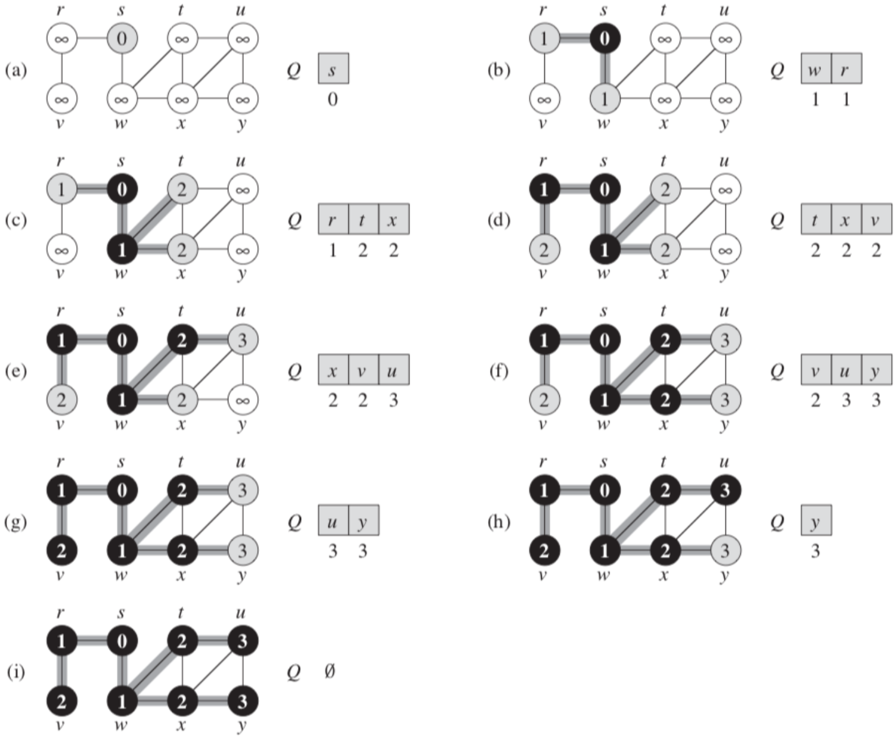

# Innhold


# Forelesning 8 - Traversering av grafer
- Traverserer graf ved å besøke noter vi vet om
- Kjenner i utgangspunktet kun startnoden, men oppdager naboene til de vi besøker
- Læringsmål:   
    - Forstå hvordan grafer kan implementeres
    - Forstå BFS, også for å finne korteste vei uten vekter
    - Forstå DFS og parentesteoremet
    - Forstå hvordan DFS klassifiserer kanter
    - Forstå TOPOLOGICAL-SORT
    - Forstå hvordan DFS kan implementeres med en stakk
    - Forstå hva traverseringstrær (som bredde-først- og dybde-først-trær) er
    - Forstå traversering med vilkårlig prioritetskø

## Kapittel 22 - Elementære grafalgoritmer
- Ser på hvordan grafer representeres og hvordan man kan søke i dem ved å følge kanter

### 22.1 Representasjoner av grafer
- Nabolister: tregest, men tar lite plass
    - Brukes for sparsomme grafer, altså $|E|<<|V|²$ (mye færre kanter enn antall vertekser kvadrert)
- Nabomatriser: raskest, tar mer plass
    - Brukes ofte for tette grafer, altså $|E|\approx|V|²$ (ca likt antall kanter som vertekser kvadrert)
- Urettet graf med naboliste og nabomatrise


- Rettet graf med naboliste og nabomatrise


#### Nabolister – krever lite plass, men tregere
- Representeres av graf $G=(V,E)$, består av array av $V$ lenket lister (en for hver verteks i $V$)
- Listen til verteks $u$ vil inneholde alle verteksene $v$, så det er en kant $(u,v)\in E$


- Om $G$ er urettet graf vil $u$ sin naboliste inneholde alle vertekser som $u$ er koblet til via kant
    - Summen av lengdene til nabolistene er $2|E|$, da den representeres begge veier
- Nabolister kan brukes for å representere vektede grafer, hvor vekt til kant gis av vektfunksjon $w$. Lagrer vekt $w(u,v)$ til kant $(u,v)$ med verteks $v$ i naboliste til $u$

#### Nabomatriser – raskere, men krever mer plass
- Nabomatrise representasjon av graf $G=(V,E)$ antar at vertekser er nummerert $1,2,...,|V|$ og består av $|V|\times |V|$ matrise $A=(a_{ij})$ så 

$$
a_{ij} = \begin{cases}
1 & \text{hvis } (i,j) \in E \\
0 & \text{ellers}
\end{cases}
$$

- Om $G$ er urettet graf vil rad til $u$ ha 1 for alle vertekser som $u$ er koblet til via kant
- For urettet graf er det symmetri om hoveddiagonal
- Om $G$ er rettet graf vil rad til $u$ kun ha 1 for verteksene som kanten til $u$ peker mot
- Nabomatriser kan brukes ti lå representere vektede grafer. Gjøres ved å lagre vekt $w(u,v)$ til kant $(u,v)$
- Krever $\theta(V²)$ lagringsminne uansett antall kanter. Er derfor ikke egnet traversering. Er likevel generelt enklere enn lister, og gjør raske oppslag  


#### Nabolister vs Nabomatriser
- Nabolister er gode til traversering og tar liten plass ved få kanter, men stor plass ved mange kanter
- Nabomatriser er gode til direkte oppslag
- Traversering: besøke og oppdage noder langs kanter, vedlikeholde huskeliste
    - Har to former, Bredde først søk og Dybde først søk

### 22.2 Bredde-først-søk (BFS)
- BFS er enkel algoritme for å søke i graf
- Gitt graf $G=(V,E)$ og kildeverteks $s$ undersøker BFS systematisk alle kanter til $G$ for å oppdage alle verteksene som kan nås fra $s$
- Regner ut avstand fra $s$ (minimum antall kanter), og produserer BFS tre med rot $s$, som inneholder alle verteksene som kan nås. Vil ha enkle/korteste banen fra $s$ til $v$ (grafen som inneholder færrest kanter)
- BFS virker på rettede og urettede grafer
- Algoritme kaller bredde-først fordi den vil oppdage alle verteksene ved avstand $k$ fra $s$ før den oppdager noen av verteksene ved avstand $k+1$
- Fargelegger hver verteks hvit, grå eller sort for å holde styr på fremgang til BFS
- Hvit er starttilstand, grå er oppdaget og sort er at alle nabonoder er oppdaget
- BFS produserer bredde først tre som først kun inneholder roten, og legger til vertekser når de oppdages
- Egenskaper: $u.color$ (fargen til verteks), $u.\pi$ (lager forgjenger til verteks $u$), $u.d$ (lagrer avstand fra kildeverteks $s$ til verteks $u$)
- BFS bruker FIFO lø for å holde oversikt over oppdagede vertekser

##### BFS
Fungerer som beskrevet over, se eksempel her 

```
BFS(G,s)
 1 for each vertex u in G.V - {s}
 2    u.color = WHITE
 3    u.d = ∞
 4    u.pi = NIL
 5 s.color = GRAY
 6 s.d = 0
 7 s.pi = NIL
 8 Q = Ø
 9 ENQUEUE(Q,s)
10 while Q != Ø
11    u = DEQUEUE(Q)
12    for each v in G.Adj[u]
13       if v.color == WHITE
14          v.color = GRAY
15          v.d = u.d + 1       
16          v.pi = u
17          ENQUEUE(Q,v)
18    u.color = BLACK
```
#### Korteste bane
- Korteste-bane avstand $\delta(s,v)$ er minimum antall kanter i enhver bane fra $s$ til $v$ ($\infty$ om det ikke finnes en bane)
- BFS regner ut korteste-bane avstand når vi bruker FIFO kø
- Skal vise at BFS regner ut $v.d=\delta(s,v)$ for hver verteks $v\in V$

##### Lemma 1
- Lar $G=(V,E)$ være rettet eller urettet graf og $s$ være vilkårlig verteks
- Gjelder for hver kant $(u,v)\in E$: $\delta(s,v)\leq \delta(s,u)+1$
- Om $u$ kan nås fra $s$ kan også $v$ nås fra $s$, så korteste bane fra $s$ til $v$ kan ikke være lenger enn korteste bane fra $s$ til $u$ etterfulgt kant $(u,v)$. Om $u$ ikke kan nås vil $\delta(s,u)=\infty$, ulikhet gjelder enda

##### Lemma 2
- Om BFS kjører fra kildeverteks $s$ vil verdi $v.d$ som regnes ut tilfredsstille $v.d\geq \delta(s,v)$ ($v.d$ er øvre grense). Beviser ved induksjon:
    - Grunntilfellet: $s.d=0=\delta(s,s)$ og $v.d=\infty\geq\delta(s,v)$, så $v.d\geq\delta(s,v)$ er oppfylt for alle $v\in V$
    - Induktivt steg: induktiv hypotese er at $u.d\geq\delta(s,u)$
        - Linje 15 i pseudokode og formel over gir $v.d = u.d+1\geq\delta(s,u)+1\geq\delta(s,v)$. Avstanden endres ikke, induktiv hypotese stemmer

##### Lemma 3
- Kø $Q$ vil alltid holde maksimum to ulike $d$ verdier, fordi køen er FIFO
- Antar $Q$ inneholder verteksene $<v_1,v_2,...,v_r>$ der $v_1$ er ved hodet og $v_r$ er ved halen
    - Vil da ha $v_r-d\leq v_1.d+1$ ($v_r$ er kun en kant lenger borte fra $s$) pg $v_i.d\leq v_{i+1}.d$ (vertekser med halen er lenger eller like langt borte fra kildeverteksen som vertekser ved hodet)

##### Teorem - korrekthet BFS
- Har $G=(V,E)$ være rettet eller urettet graf, og antar at BFS kjører en kildeverteks $s\in V$. 
- I løpet av utførelsen vil $BFS$ oppdage alle vertekser $v\in V$ som kan nås fra $s$, og ved terminering vil $v.d=\delta(s,v)$ for alle $v\in V$.
- For $v\neq s$ vil korteste bane fra  $s$ til $v$ være korteste bane fra $s$ il $v.\pi$ etterfulgt av kanten $(v.\pi,v)$
- Kan bevises med motsigelse: antar verteks $v$ med korteste-bane $\delta(s,v)$ får feil avstand $v.d\neq\delta(s,v)$
    - Lemma 2 gir at $v.d\geq\delta(s,v)$, som blir $v.d>\delta(s,v)$
    - Lemma 1 gir at $\delta(s,v)=\delta(s,u)+1$, har at $u.d=\delta(s,u)$. Får: $v.d>\delta(s,v)=\delta(s,u)+1=u.d+1$
- Lar $v$ være verteks som undersøkes som følger av at det er naboverteks til $u$. Tre tilfeller, hvor alle motsier ulikheten
    1. $v$ er hvit, som gir $v.d=u.d+1$
    2. $v$ er sort, så den har blitt fjernet før $u$ og dermed bil lemma 3 gi $v.d\leq u.d$
    3. $v$ er grå, så den har blitt oppdaget fordi den er nabomatrisen til en verteks $w$ som ble fjernet før $u$. Derfor vil linje 15 gi $v.d=w.d+1$ pg lemma 3 gir $w.d\leq u.d$, så $v.d=w.d+1\geq u.d+1$
- Kan konkludere at $v.d=\delta(s,v)$ for alle $v\in V$

#### Bredde-først tre
- Korresponderer til $\pi$ egenskapene (forgjengerne)


### 22.3 Dybde-først-søk (DFS)
- Søker dypere så lenge det er mulig
- Undersøker kanter i mest nylig oppdaget verteks som enda er uoppdagede kanter. Når alle kanter er oppdaget går metoden tilbake til verteks som nåværende verteks ble oppdaget fra. Prosess fortsetter til alle vertekser som kan nå fra kildeverteks er oppdaget
- Om det finnes uoppdagede vertekser velger DFS ny kilde og leter derfra, og gjentar prosess til alle vertekser er oppdaget

#### Dybde-først tre
- Om DFS søker i naboliste til verteks $u$ og oppdager verteks $v$ setter den $v.\pi=u$.

#### DFS algoritme
- Bruker LIFO-stack 
- DFS fargelegger vertekser i hvitt, grått og sort
    - Hver verteks ender opp i kun ett dybde først tre
- Bruker tidsstemplene $v.d$ (tid når $v$ oppdages) og $v.f$ (tid når søket er ferdig å undersøke nabolisten til $v$ ($v$ blir sort))

##### DFS
- Lager dybde-først skog for graf $G$
- Metode tar inn graf
- For løkke ved linje 1-3 gir alle vertekser hvit farge og setter forgjenger til NIL
- Linje 4 resetter global time teller
- For løkke ved linje 5-7 ser på alle verteksene $u\in V$, og om den er hvit kalles DFS-VISIT
- Kallet gjør at $u$ blir rot til nytt tre
- Vil til slutt hver verteks ha fått oppdagelsestid $u.d$ og ferdigtid $u.f$
- Kjøretid $\theta(V+E)$
```
DFS(G)
1 for each vertex u in G.V
2    u.color = WHITE
3    u.pi = NIL
4 time = 0 
5 for each vertex u \in G.V
6    if u.color == WHITE
7       DFS-VISIT(G,i)
```

##### DFS-VISIT
- Lager dybde først tre for graf med rot $s$
- Metode tar inn graf $G$ og verteks $u$ som er kildeverteks og lager et dybde først tre
- Linje 1: øker time variabel
- Linje 2: setter u.d til time
- Linje 3: setter farge til grå
- Linje 4: undersøker alle vertekser i naboliste til $u$. Om verteks $v$ er hvit vil forgjenger til $v$ settes til $u$ og vi utfører rekursivt kall med $v$ som kildeverteks
    - Rekursivt kall sørger for at alle vertekser i naboliste til $v$ oppdages og farges. $v$ farges sort og for-løkke i opprinnelig kall går videre til neste verteks i naboliste til $u$ 


```
DFS-VISIT(G,u)
 1 time = time + 1
 2 u.d = time
 3 u.color = GRAY
 4 for each v in G.Adj[u]
 5    if v.color == WHITE
 6       v.pi = u
 7       DFS-VISIT(G,v)
 8 u.color = BLACK
 9 time = time + 1
10 u.f = time
```

#### Parentesteoremet


##### Parentesteoremet (viktig)


##### Hvit-bane teoremet


#### Klassifisering av kanter


### 22.4 Topologisk sortering


##### TOPOLOGICAL-SORT 


#### Korrekthet til topologisk sortering


## Appendiks E – Generell graftraversering