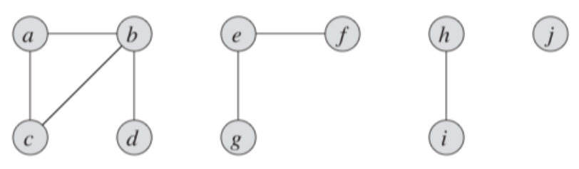
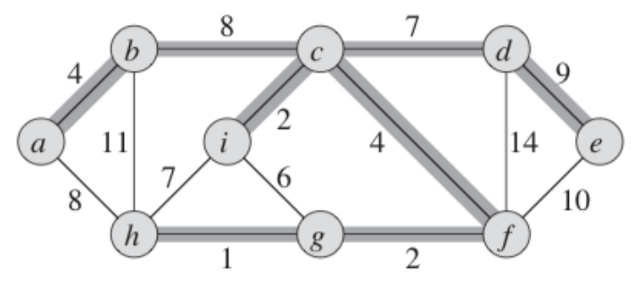
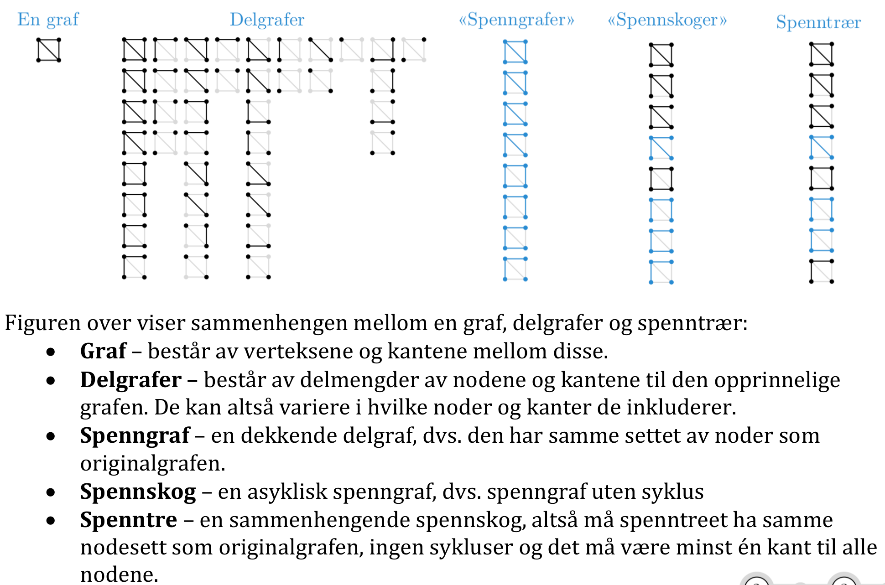
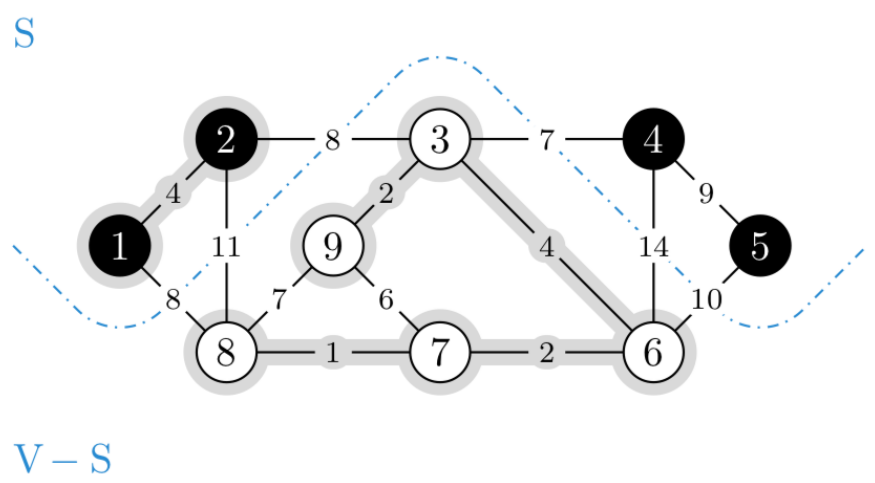
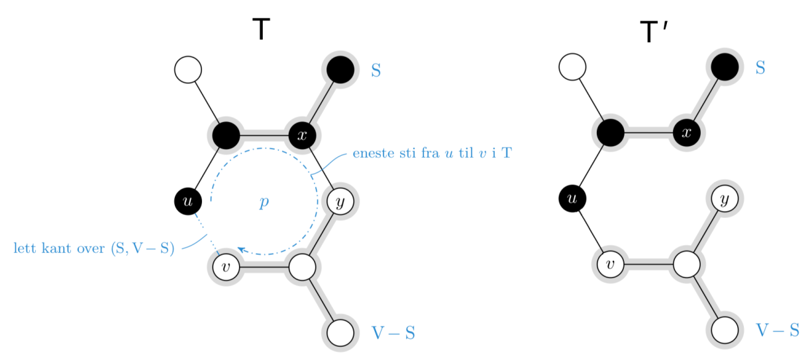
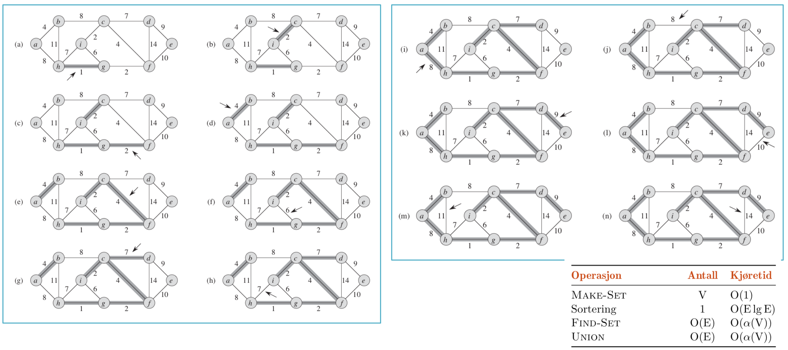
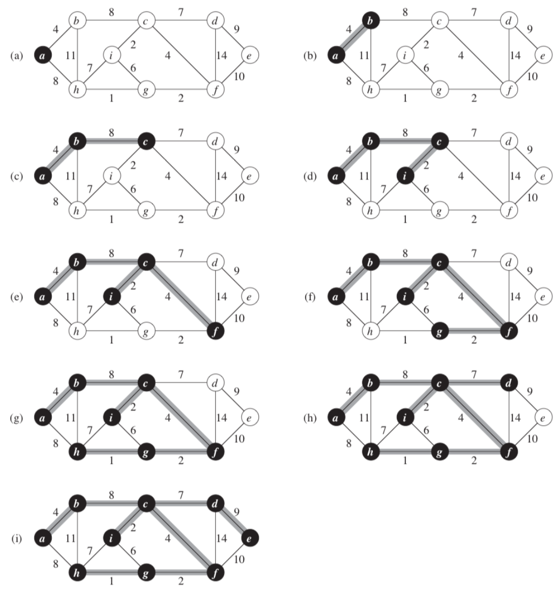

# Innhold
- [Forelesning 9 - Minimale spenntrær](#forelesning-9---minimale-spenntrær)
    - [Kapittel 21 - Datastrukturer for disjunkte sett](#kapittel-21---datastrukturer-for-disjunkte-sett)
        - [21.1 Disjunkt-sett operasjoner](#211-disjunkt-sett-operasjoner)
        - [21.3 Disjunkte-sett skoger](#213-disjunkte-sett-skoger)
    - [Kapittel 23 - Minimale spenntrær](#kapittel-23---minimale-spenntrær)
        - [23.1 Vekst av et minimalt spenntre](#231-vekst-av-et-minimalt-spenntre)
        - [23.2 Kruskals og Prims algoritme](#232-kruskals-og-prims-algoritme)

# Forelesning 9 - Minimale spenntrær
- Graf med vekter på kantene, ønsker å holde akkurat kantene vi må for å koble sammen noder, med lavest mulig vektsum
- Grådig
- Læringsmål:
    - Forstå skog-implementasjon av disjunkte mengder (CONNECTED-COMPONENTS, SAME-COMPONENT, MAKE-SET, UNION, LINK, FIND-SET)
    - Vite hva spenntrær og minimale spenntrær er
    - Forstå GENERIC-MST
    - Forstå hvorfor lette kanter er trygge kanter
    - Forstå MST-KRUSKAL
    - Forstå MST-PRIM

## Kapittel 21 - Datastrukturer for disjunkte sett
- Kan ønske å fordele $n$ elementer over samling av disjunkte sett (atskilte/ikke-overlappende sett)
- Vanlige operasjoner for å finne det unike settet som inneholder et bestemt element, eller forening av to sett

### 21.1 Disjunkt-sett operasjoner
- Disjunkt-sett datastrukturen inneholder samling $S=\{S_1, S_2,...,S_k\}$ av disjunkte dynamisle sett (sett som støtter innsetting og sletting)
- Representant brukes for å identifisere hvert sett, og det er et medlem av settet (kan være roten til et tre eller det mindte elementet)
- Hvert element i settet representeres av objekt $x$
- Følgende operasjoner implementeres: 
    - MAKE-SET(x): lager nytt sett hvor eneste medlem er $x$. Settene er disjunkte, så ingen andre sett kan ha $x$
    - UNION(x,y): forener settene som inneholder $x$ og $y$, til nytt sett som er union av settene, $S_x\cup S_y$. Representant blir element fra ene unionen (ofte representanten til $S_x$ eller $S_y$). Settene i $S$ er disjunkte, så fjerner $S_x$ og $S_y$ fra $S$, og legger til det nye settet
    - FIND-SET(x): returnerer peker mot representanten til settet som har $x$
- Kjøretid til disjukt-sett datastrukturer analyseres ved $n$, som er antall $MAKE-SET$ operasjoner eller $m$, som er totalt antall MAKE-SET, UNION og FIND-SET operasjoner ($m\geq n$). 
- Etter $n$ MAKE-SET operasjoner har vi $n$ disjunkte sett
- Hver UNION operasjon reduserer antall sett med 1, så antall UNION operasjoner er max $n-1$ (har ett sett igjen)

#### Bruksområde for disjunkt-sett datastruktur (viktig)
- Disjunkt-sett datastrukturer brukes for å bestemme komponenter som er koblet sammen i urettet graf. Urettet graf kan bestå av en eller fler koblede komponenter, som er vertekser koblet sammen av kanter.
- Figur er urettet graf med fire koblede komponenter


##### CONNECTED-COMPONENTS
- Finner koblede komponenter
- Bruker operasjoner for disjunkte sett til å finne koblede komponenter i urettet graf
- Begynner å plassere alle vertekser i hvert sitt disjunkte sett
- Deretter går den gjennom alle kanter, og for hver kant $(u,v)$ vil den forene settende som inneholder $u$ og $v$ dersom dette er to disjunkte sett
- Etter å ha gått gjennom alle kanter vil metoden ha produsert samling av disjunkte sett, hvor hvert sett inneholder alle verteksene i en koblet komponent
```
CONNECTED-COMPONENTS(G)
1 for each vertex v in G.V
2    MAKE-SET(v)
3 for each edge (u,v) in G.E
4    if FIND-SET(u) != FIND-SET(v)
5       UNION(u,v)
```

##### SAME-COMPONENT
- Sjekker om vertekser er i samme koblede komponent
- Metoden returnerer TRUE om to vertekser er i samme disjunkte sett, false ellers
```
SAME-COMPONENT(u,v)
1 if FIND-SET(u) == FIND-SET(v)
2    return TRUE
3 else return FALSE
```
### 21.3 Disjunkte-sett skoger
- Sett/menger kan representeres av rotfaste trær
- I disjunkt-sett skog peker hvert medlem kun mot egen foreldrenode, og roten va treet er representant for settet og er sin egen foreldrenode
- MAKE-SET operasjonen lager et tre med en node, FIND-SET operasjonen følger foreldepekerne til den finner roten, UNION operasjonen slår sammen to trær ved at den ene roten peker på den andre roten
- For å forbedre kjøretid introduseres to heuristikker (tommelregler)

#### Heuristikker for å forbedre kjøretiden
- Bruker to heuristikker for å oppnå kjøretid nesten lineær totalt antall operasjoner $m$
    1. Union etter rand: for hver node holder vi styr på en rang, med øvre grense på høyden til noden (maksimum antall kanter fra $x$ til et blad som er etterfølger av $x$). I UNION etter rang får vi roten med lavere rang til å peke mot roten med høyere rang. Enkelt og effektivt = good
    2. Banesammenlikning: hver node som besøkes i FIND-SET(a) (langs find path/nodene som besøkes) settes til å peke direkte mot roten. Endrer ikke rangen av nodene.

#### Operasjoner for disjunkt-sett skoger (viktig)
- Inkluderer union etter rang og banesammenlikning. Har da tre operasjoner for disjunkt-sett skoger: MAKE-SET, UNION, LINK, FIND-SET

##### MAKE-SET
- Lager ny disjunkt-sett skog hvor $x$ er eneste medlem
- Tar inn node $x$, setter roten til å være $x$ og rangen til å være $0$
```
MAKE-SET(x)
1 x.p = x
2 x.rank = 0
```
##### UNION
- Forener to disjunk-sett skoger via LINK prosedyre
```
UNION(x,y)
1 LINK(FIND-SET(x),FIND-SET(y))
```
##### LINK
- Forener to disjunkte-sett skoger basert på rang
- Tar inn to røtter og forener tilhørende disjunkte skoger
- Om $x$ sin rang er høyest, beker $y$ på $x$ og rang er uendret.
- Om $x$ og $y$ har lik rang, velger vi en av de vilkårlig og øker rangen med 1, og setter  den andre roten til å peke mot den
```
LINK(x,y)
1 if x.rank > y.rank
2    y.p = x
3 else x.p = y
4    if x.rank == y.rank
5       y.rank = y.rank + 1 
```
##### FIND-SET
- Returnerer peker mot rot til disjunkt sett i skogen
- Metoden tar inn node $x$ og returnerer peker mot roten og får alle nodene mellom $x$ og roten (find-path) til å peke mot roten
- Om $x$ ikke er roten, kalles metoden rekursivt på foreldrenoden til $x$
- Tilslutt vil $x=x.p$ og $x.p$ returneres (roten som har seg selv som forelder)
```
FIND-SET(x)
1 if x = x.p
2    x.p = FIND-SET(x,p)
3 return x.p
```
#### Heuristikk sin effekt på kjøretiden
- Union ved rang alene gir kjøretid på $O(m\log(n))$ som er en tett grense
- For $n$ MAKE-SET operasjoner og $f$ FIND-SET operasjoner, vil banesammenligning alene gi worst-case kjøretid $\theta(n+f\cdot (1+\log_{2+f/n}n))$
- Dersom man bruker begge vil worst-case kjøretid være $O(m\alpha(n))$ der $\alpha(n)=O(\log(n))$ er en vekstfunksjon som vokser svært sakte

## Kapittel 23 - Minimale spenntrær
- Urettet graf $G=(V,E)$ hvor hver kant $(u,v)\in E$ har vekt $w(u,v)$ som gir kostnad forbundet med å koble sammen $u$ og $v$
- Ønsker å finne asyklish subset $T\subseteq E$ som kobler alle vertekser og minimerer total vekt av 
$$
w(T)=\sum_{(u,v)\in T}w(u,v)
$$
- Siden $T$ er asyklisk og kobler sammen alle vertekser så vekten minimeres, må den danne tre som kalles minimalt spenntre til graf $G$. Problem med å bestemme treet $T$ kalles minimum-spenntre problemet
    - Innebærer å finne hvilke kanter som skal velges for å danne minimum spenntre, så vekten minimeres og det ikke dannes syklus



- Minimalt spenntre problemet kan løses med Kruskals algoritme og Prims algoritme, som har kjøretid $O(E\log V)$, dersom ordinære binære heaps blir brukt
    - Er grådige algorimer, som alltid tar valget som ser billigst ut i øyeblikket

 

### 23.1 Vekst av et minimalt spenntre
- Ønsker å finne minimalt spenntre for graf $G=(V,E)$ som er koblet, urettet og har vektfunksjonen $w(u,v)$
- Skal vise med generisk metode som lar spenntreet vokse ved å legge til en kant av ganger til kantmengde $A$
- Loop invarianten er at $A$ utgjør en del av minimalt spenntre før hver iterasjon
- Trygg kant er kant som bevarer invarianten. $(u,v)$ er trygg kant om den kan legges til $A$, så $A\cup (u,v)$ fortsatt er del av minimalt spenntre

##### GENERIC-MST
- Grådig metode for å finne minimalt spenntre
- Metoden tar inn graf $G=(V,E)$ og vektfunksjon $w$, og returnerer sett kanter $A$ som representerer minimalt spenntre. Metoden begynner med å initialisere $A$ til et tomt sett. While-løkken legger til en ny trygg kant så lenge A ikke er MST enda (A ikke har dekt alle nodene i $G$)
- Loop invariant:
    - Initialisering: etter linje 1 vil $A=Ø\subseteq T$
    - Vedlikehold: kun trygge kanter legges til, derfor vil $A$ fortsette å være del av minimalt spenntre etter hver iterasjon av while-løkken
    - Terminering: alle kanter som legges til $A$ er i et MST, og derfor returneres $A$ som minimalt spenntre   
- Et snitt $(S,V-S)$ er oppdeling av nodesettet $V$ (blå linje i figur)
- En kant $(u,v)\in E$ krysser kuttet dersom $u$ er i $S$ og $v$ er i $V-S$. Et snitt repekterer kantmengden $A$ dersom ingen kanter i $A$ krysser snittet. En lett kant over et snitt er kanten med minimal vekt blant kantene som krysser snittet.


```
GENERIC-MST(G,w)
1 A = Ø
2 while A does not form a spanning tree
3    find an edge (u,v) that is safe for A
4    A = A U {(u,v)}
5 return A
```

#### Trygg kant teoremet
- La $G=(V,E)$ være en koblet, urettet graf med vektfunksjon $w$ og $A$ være subsett av $E$ som er inkludert i minimalt spenntre for $G$. Om $(S,V-S)$ er et snitt av $G$ som respekterer $A$ og $(u,v)$ er en lett kant som krysser $(S,V-S)$, så vil (u,v) være en trygg kant for $A$
- For å bevise dette settes $T$ til å være MST som inneholder $A$, men ikke $(u,v)$
- Bruker klipp og lim teknikk for å vise at man kan lage annet MST $T'$ som inkluderer $A\cup \{(u,v)\}$. Tre ting må bevises:
    1. $T'$ er et spenntre: MST $T$ må være koblet til alle vertekser i grafen
        - Siden $(u,v)\notin T$ må det være enkel bane $p$ som kobler $u$ til $v$, så om vi legger til $(u,v)$ dannes det syklus (figur).
        - Har snitt $(S,V-S)$ som deler $T$ i to, hvor $u$ og $v$ er på hver sin side. Betyr at banen må inneholde kant $(x,y)$ som krysser snittet.
        - Siden snittet repsekterer $A$, kan ikke $(x,y)$ være en kant i $A$
        - Om vi gjerner kanten $(x,y)$ vil $T$ deles i to separate komponenter. 
        - Legger så til $(u,v)$ for å koble komponentene sammen igjen, får nytt spenntre: $T'=T-\{(x,y)\}\cup \{(u,v)\}$

        
    2. $T'$ er et MST: Både $(x,y)$ og $(u,v)$ krysser $(S,V-S)$ og siden $(u,v)$ er lett kant vil $w(u,v)\leq w(x,y)$. Derfor vil:
        $$
        w(T')=w(T)-w(x,y)+w(u,v)\leq w(T)
        $$
        - Siden $T$ er et MST vil $w(T')\leq w(T)$ bety at $T'$ også er MST
    3. $(u,v)$ er en trygg kant for $A$: siden $A\subseteq T$ og $(x,y)\notin A$, vil også $A\subseteq T'$. Siden $(u,v)\in T'$ vil $A\cup \{(u,v)\}\subseteq T'$. Derfor vil $(u,v)$ være trygg kant for $A$
- Teoremet gir at en lett kant over snitt som respekterer løsningen vil være trygg kant, som gjør at vi kan løse problemet med grådig algoritme

#### Egenskaper ved $A$ som følger av trygg-kant-teoremet
- Under GENERIC-MST vil A alltid være asyklisk fordi ellers vil $T$ som inkluderer $A$ inneholde syklus, som er motsigelse
- Grafen $G_A=(V,A)$ vil være en skog og hver av koblede komponenter i $G_A$ er et tre
- Trygg kant $(u,v)$ kobler sammen to trær i $G_A$, siden $A\cup \{(u,v)\}$ må være asyklisk. Når $A=Ø$ vil det være $|V|$ trær (en for hver verteks) og hver iterasjon av while-løkken reduserer antallet med $1$, siden to trær kombineres
- Når skogen kun består av ett tre, terminerer metoden
- Om $C=(V_C,E_C)$ er en koblet komponent i skogen $G_A=(V,A)$, så vil $(u,v)$ være trygg kant for $A$ dersom det er lett kant som kobler $C$ til annen komponent i $G_A$

### 23.2 Kruskals og Prims algoritme
- Utvidelser av generisk metode og bruker ulike regler for å bestemme trygge kanter
- Kruskals algoritme: settet $A$ danner skog av flere trær. Den trygge kanten er den med minst vekt i grafen og som kobler sammen to ulike vertekser uten å danne syklus
- Prims algoritme: settet $A$ danner et enkelt tre. Den trygge kanten med minst vekt som kobler treet til en verteks som ikke er i treet. 

#### Kruskals algoritme
- Finner trygg kant som legges til i voksende skog ved å gå gjennom alle kantene som kobler sammen to trær i skogen og velger kanten $(u,v)$ med minst vekt
- Ved hvert steg legger algoritmen til kanten med minst mulig vekt, derfor en grådig algoritme 

##### MST-KRUSKAL
- Finner MST
- Metoden tar inn $G=(V,E)$ og en vektfunksjon $w$, og returnerer kantmengde $A$ som representerer MST til $G$. 
- For-løkke ved linje 2: bruker MAKE-SET for å lage $|V|$ trær som inneholder en verteks hver
- For-løkke ved linje 4: sorterer kantene i $G$ i økende rekkefølge basert på vekten
- For-løkke ved linje 5: går gjennom alle kantene. Kant $(u,v)$ slår sammen to trær om $u$ er i det ene treet og $v$ er i det andre 
- Sortering av kanter sørger for at $(u,v)$ er kanten med minst vekt, siden $u$ og $v$ er i hvert sitt tre kan ikke unionen danne syklus, så $(u,v)$ er trygg kant for $A$ og legges til i kantmengden
- UNION brukes til å kombinere to trær. Om $u$ og $v$ er i samme tre vil ingenting skje. Gjentas helt til alle trærne i skogen er koblet sammen til ett. Metoden returnerer $A$
- Kjøretid $O(E\log(V))$


```
MST-KRUSKAL(G,w)
1 A = Ø
2 for each vertex v in G.V
3    MAKE-SET(v)
4 sort the edges of G.E into nondecreasing order by weight w 
5 for each edge (u,v) in G.E, taken in nondecreasing order by weight
6    if FIND-SET(u) != FIND-SET(v)
7       A = A U {(u,v)}
8       UNION(u,v)
9 return A
```

##### Kruskals algoritme analyse
- Kjøretid: $O(E\log(V))$

#### Prims algoritme
- Finner MST på liknende måte som Dijkstras algoritme finner korteste bane i graf
- Kantene ved Prims algoritme vil kantene i kantmengden $A$ alltid danne ett enkelt tre
- Treet har vilkårlig rot og vokser til det dekker alle vertekser i $V$
- Hvert steg legger til lett kant som kobler $A$ til en verteks som ikke allerede er i $A$.
- Må ha rask måte å velge neste kant for å være effektiv
    - Bruker min prioritetskø $Q$ som holder alle vertekser som ikke er i treet. Verteks i $Q$ har $key$-attributt som er minste vekt til kant som kobler verteks til treet. Om verteksen ikke har kant til treet er $v.key=\infty$. Foreldreverteksen til $v$ gis av $v.\pi$

##### MST-PRIM
- Finner MST
- Tar inn graf $G=(V,E)$, vektfunksjon $w$ og roten $r$, og lager MST som lagres i $v.\pi$ attributter
- Første for-løkken vil gå gjennom alle verteksene og initalisere $key$ og $\pi$ attributtene. $key$ attributten til roten settes lik $0$ og min-prioritetskøen $Q$ fylles med alle verteksene, siden køen skal inneholde alle verteksene som ikke er i treet
- While-løkken utføres så lenge køen ikke er tom. EXTRACT-MIN henter ut verteks som er koblet til treet med letteste kanten. 
    - Neste for-løkke oppdaterer naboverteksene til $u$. Om naboverteksene ikke er del av treet og vekten til $(u,v)$ er lavere enn nåværende $key$-attributt til $v$ settes $v.\pi=u$ og oppdatere $key$-attributt til å være vekten til kanten $(u,v)$. 
        - If-setning brukes for å sikre at key-attributten er lik letteste kant  mellom noden og treet ($u$ er del av treet siden den fjernes fra $Q$, så derfor vil $(u,v)$ være en kant mellom noten og treet)
- Kjøretid: $O(E\log(V))$


```
MST-PRIM(G,w,r)
 1 for each u in G.V
 2    u.key = ∞
 3    u.pi = NIL
 4 r.key = 0
 5 Q = G.V
 6 while Q != Ø
 7    u = EXTRACT-MIN(Q)
 8    for each v n G.Adj[u]
 9       if v in Q and w(u,v) < v.key
10          v.pi = u
11          v.key = w(u,v)
```

##### Prims algoritme analyse
- Kjøretid: $O(E\log(V))$