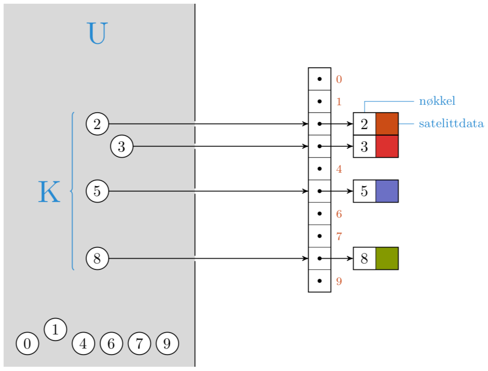
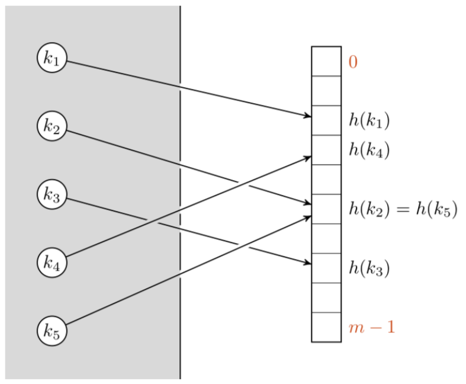

# Innhold
- [Forelesning 2 - Datastrukturer](#forelesning-2---datastrukturer)
    - [Kapittel 10 - Elementære datastrukturer](#kapittel-10---elementære-datastrukturer)
        - [10.1 Stacks og queues](#101-stacks-og-queues)
        - [10.2 Linked list](#102-linked-list)
    - [Kapittel 11 - Hash tabeller](#kapittel-11---hash-tabeller)
        - [11.1 Direkte-adresse tabeller](#111-direkte-adresse-tabeller)
        - [11.2 Hash tabeller](#112-hash-tabeller)
        - [11.3 Hash funksjoner](#113-hash-funksjoner)
    - [16.4 Dynamic tables from book](#164-dynamic-tables-from-book)
    - [Kapittel 17 - Amortisert analyse](#kapittel-17---amortisert-analyse)
    - [Forelesning 2](#forelesning-2)

# Forelesning 2 - Datastrukturer

- Datastruktur er måte å lagre og organisere data
    - Gjør det lettere å endre og aksessere dataen
- Ulike datastrukturer har ulike styrker og begrensninger
- Dynamiske sett: sett som kan vokse, krype og endres over tid

- Læringsmål:
    - Forstå hvordan stakker og køer fungerer (STACK-EMPTY, PUSH, POP, ENQUEUE, DEQUEUE)
    - Forstå hvordan lenkede lister fungerer (LIST-SEARCH, LIST-INSERT, LIST-DELETE)
    - Forstå hvordan direkte addressering og hashtabeller fungerer (HASH-INSERT, HASH-SEARCH)
    - Forstå konfliktløsing ved kjeding (chaining) (CHAINED-HASH-INSERT, CHAINED-HASH-SEARCH, CHAINED-HASH-DELETE)
    - Kjenne til grunnleggende hashfunksjoner
    - Vite at man for statiske datasett kan ha worst-case $O(1)$ for søk
    - Kunne definere amorisert analyse
    - Forstå aggregert analyse
    - Forstå hvordan dynamiske tabeller fungerer (TABLE-INSERT)

## Kapittel 10 - Elementære datastrukturer

### 10.1 Stacks og queues
- Stack: Last in, first out (LIFO)
- Queue: First in, first out (FIFO)

#### Stacks
- INSERT: `PUSH` funkjson, setter et element på sluttet
- DELETE: `POP` funksjon, sletter elementet på siste posisjon
- Stack med $n$ elementer er array $S[1,...,n]$
    - `S.top`$ = n$
        - `S.top` $= 0$: $S$ er tom
        - `S.top` $= n$: $S$ er full

##### STACK-EMPTY
- Sjekker om stack er tom
- $O(1)$
```
STACK-EMPTY(S)
1 if S.top == 0
2   return TRUE
3 else return FALSE
```

##### PUSH 
- Legger til et element og øker `S.top`
- $O(1)$
```
PUSH(S,x)
1 S.top = S.top + 1
2 S[S.top] = x
```

##### POP
- Fjerner et element
- $O(1)$
```
POP(S)
1 if STACK-EMPTY(S)
2   error "underflow"
3 else S.top = S.top - 1
4   return S[S.top + 1]
```

#### Queues
- Head/hode er front, tail/hale er bak
- Insert: `ENQUEUE` funksjon, legger til element på halen
- Delete: `DEQUEUE` funksjon, fjerner element fra hodet
- Queues er wrap around. Lokasjon 1 følger etter lokasjon $n$ på sirkulær måte.
- Queue er tom når $Q.tail = Q.head = 1$
- Queue er full når $Q.head=1$ og $Q.tail=Q.length$ eller $Q.head=Q.tail+1$ 
    - Full når der kun er en ledig plass igjen i en array, så man kan skille mellom head og tail

##### ENQUEUE
- Legger til element $x$ ved $Q.tail$. Om $Q.tail$ er enden av array flyttes halen til started (wraparound). Ellers øker $Q.tail$ med en. 
- Får overflow om man kjører `ENQUEUE` på full lisre
```
ENQUEUE(Q,x):
1 Q[Q.tail] = x
2 if Q.tail == Q.length
3   Q.tail = 1
4 else Q.tail = Q.tail + 1
```
- Kjøretid: $O(1)$

##### DEQUEUE
- Fjerner hodet, lagrer det i $x$ og returnerer $x$
- Om $Q.head$ er i enden av arrayen flytted $Q.head$ til starten, ellers øker man det med 1
```
DEQUEUE(Q):
1 x = Q[Q.head]
2 if Q.head == Q.length
3   Q.head = 1
4 else Q.head = Q.head + 1
5 return x
```
- Kjøretid: $O(1)$

### 10.2 Linked list
- Datastruktur med objekter linjet lineært
- Rekkefølge bestemmes av peker til hvert objekt
- Dobbelt linked list: hvert element er objekt med en $key$ egenskap og to pekeregenskaper, $prev$ og $next$
    - Ved element $x$ vil $x.next$ peke mot neste element og $x.prev$ på forrige element.
    - $x.next=NIL$ betyr at det ikke er noe neste element, $x$ er halen
    - $x.prev=NIL$ betyr at det ikke er noe forrige element, $x$ er hodet
- Enkelt linked list: som dobbelt linked list, uten $prev$ peker

- Linked list kan være sortert, så lineær rekkefølge til listen er lik lineær rekkefølge til $key$-verdiene til elementene (minste elementet ved hodet, største ved halen)
- Linked list kan være sirkulær

#### LIST-SEARCH
- Finner første element med $key$ $k$ i liste $L$. Returnerer peker til elementet (NIL om objectet ikke finnes)
- Worstcase kjøretid: $\Theta(n)$
```
LIST-SEARCH(L,k)
1 x = L.head
2 while x ≠ NIL and x.key ≠ k
3   x = x.next
4 return x
```

#### LIST-INSERT
- Legger til element i fronten av lista
- $x$ får $next$ peker til første element i $L$. Om $L$ har et første element setter vi $prev$ pekeren til dette objektet til $x$. Om $L$ er tom vil $x.next$ være $NIL$. Setter første element i $L$ lik $x$ og $prev$ pekeren til $x$ er derfor $NIL$.
- Kjøretid: $O(1)$  
```
LIST-INSERT(L,x)
1 x.next = L.head
2 if L.head ≠ NIL
3   L.head.prev = x
4 L.head = x
5 x.prev = NIL
```

#### LIST-DELETE
- Fjerner elementet $x$ 
- Om $x$ har et element foran må $next$ pekeren settes lik $x$ sin $next$ peker. kan være et annet element eller $NIL$
- Om $x$ er første element i listen 
- Kjøretid: $O(1)$ tid for å fjerne element, med må bruke `LIST-SEARCH` for å hente peker til $x$ i elementet. Derfor kjøretid $\Theta(n)$
    - Dobbel lenket liste har allerede pekere i begge retninger, så dette tar $O(1)$

## Kapittel 11 - Hash tabeller
- Støtter dictionary operasjoner som `INSERT`, `SEARCH` og `DELETE`
- Hashing er effektivt
    - Average kjøretid i hash tabell: $O(1)$
- Direkte adressering av array undersøker en vilkårlig posisjon iløpet av tiden $O(1)$
    - Bruker direkte adressering med array med posisjon for alle keys
    - Når antall keys er lite relativt til antall mulige keys vil hash tabeller bli effektivt alternativ til direkte adressering, da hash tabeller ofte bruker array med størrelse proporsjonal til antall keys som er lagret

### 11.1 Direkte-adresse tabeller
- Direkte adressering er en enkel teknikk, fungerer bra når universet $U$ av $keys$ er relativt lite.
- Anta dynamisk sett, hvert element har nøkker fra $U=\{0,1,...,m-1\}$ der $m$ ikke er stor og ingen elementer har samme key
    - Bruker array for å representere settet, kalles direkte-adresse tabell $T[0,...,m-1]$ der hver $key$ i universet korresponderer til index i tabellen. 



#### DIRECT-ADDRESS-SEARCH
- Returnerer elementet i direkte-adress tabellen med index $k$ (eller NIL). ELementet peker mot elementet i settet med $key$ $k$.

```
DIRECT-ADDRESS-SEARCH(T,k)
1 return T[k]
```

#### DIRECT-ADDRESS-INSERT
- Setter $x$ i direkte-adresse tabell ved index gitt av $key$-verdien til elementet

```
DIRECT-ADDRESS-INSERT(T,x)
1 T[x.key] = x
```

#### DIRECT-ADDRESS-DELETE
- Fjerner elementet $x£ fra direkte-adresse tabellen ved index gitt av $key$ verdi til elementet ved å sette elementet ved denne indeksen lik NIL

```
DIRECT-ADDRESS-DELETE(T,x)
1 T[x.key] = NIL
```

### 11.2 Hash tabeller
- Om $U$ er stort kan det være upraktisk å lagre tabellen $T$ av størrelse $|U|$. Mye av rommet kan også være bortkastet, om antall $keys$ er mye mindre enne $U$
- Kan redusere romkrav til $|\Theta(K)|$ ved å bruke hashtabeller, å fortsatt ha $O(1)$ tid.
- I direkte adressering er elementet med $key$ $k$ lagret i luke $k$, men i hashing er elementet lagret i luke $h(k)$.
    - Hashing bruker hash funksjon $h$ på $key k$ for å regne ut indexen til luken.
    - Hash funksjon tar $key$ fra $U$ og regner ut indeksen til luke i hash tabell $T[0,1,...,m-1]$: $h: U\to {0,1,...,m-1}$
    - Størrelsen $m$ til hashtabellen er ofte mye mindre enn $|U|$
    - Elementet med key $k$ hasher til luke $h(k)$
    - $h(k)$ er hash verdien til key $k$



#### HASH-INSERT

- Mål: Sette inn nøkkelen k i hash-tabellen 𝑇.
- Initialiserer probe-verdien 𝑖 til 0.
- Beregner hash-verdien for nøkkelen k og probe-verdien 𝑖, kalt 𝑗.
- Søkeprosess:
    - Sjekker luken ved posisjon 𝑗 i tabellen 𝑇.
    - Hvis luken er tom, plasseres k i denne luken.
    - Hvis luken er opptatt, økes probe-verdien 𝑖 med én.
- Iterasjon:
    - Fortsetter å øke 𝑖 og sjekke etterfølgende luker.
    - Stopper når en tom luke er funnet eller probe-verdien 𝑖 når 𝑚.
- Returverdier:
    - Returnerer indeksen til luken hvor k er plassert.
    - Returnerer feilmelding om overflow hvis hele tabellen er gjennomgått uten å finne en tom luke.

```
HASH-INSERT(T,k)
1 i = 0
2 repeat
3   j = h(k,i)
4   if T[j] == NIL
5       T[j] = k
6       return j
7   else i = i + 1
8 until i == m 
9 error "hash table overflow"
```

#### HASH-SEARCH
- For å bestemme hva som skal undersøkes inkluderer hashfunksjonen et probenummer $i$ som input, så $h:U\times \{0,1,...,m-1\}\to \{0,1,...,m-1\}$
- Initialiserer probe-verdien 𝑖 til 0.
- Setter 𝑗 lik hash-verdien for nøkkelen k og probe-verdien 𝑖.
- Sjekker om luken ved posisjon 𝑗 inneholder k.
    - Hvis ja, returnerer posisjon 𝑗.
    - Hvis nei, øker 𝑖 med én og gjentar prosessen.
- Fortsetter til en av følgende inntreffer:
    - En luke som inneholder k er funnet.
    - En tom luke (𝑁𝐼𝐿) er funnet, indikerer at k ikke er i tabellen.
    - Probe-verdien 𝑖 når 𝑚, hele tabellen er sjekket.
- Returnerer posisjon 𝑗 hvis k er funnet, ellers NIL.

```
HASH-SEARCH(T,k)
1 i = 0
2 repeat
3   j = h(k,i)
4   if T[j] == k 
5       return j
6   i = i + 1
7 until T[j] == NIL or i == m
8 return NIL
```

#### DELETE i Hash-Tabell

- Kan ikke enkelt fjerne en nøkkel ved å sette luken til NIL.
- Dette kan forstyrre gjenfinning av andre nøkler.
- Løsning: Marker luker som DELETED istedenfor NIL.
    - Tilpasning av HASH-INSERT: Tillater innsetting i luker merket som DELETED. HASH-SEARCH opererer som normalt, ignorerer DELETED-merkede luker.

#### Kollisjon
- To keys kan hashe til samme luke, kalles kollisjon 
- Kan minimere kollisjoner ved at hashfunksjonen fremstår tilfeldig (men $h$ må være deterministisk, input $k$ skal alltid gi outbut $h(k))
- Siden $|U|>m$ må det være minst to keys med samme hashverdi, så kan ikke helt unngå kollisjoner

#### Kollisjon håndtering ved chaining
- Løsning på kollisjon
- Elementer som hasher til samme luke plasered i linked list. Luke $j$ har peker som peker mot hodet til listen av elementer som hasher til $j$

##### CHAINED-HASH-INSERT
- Setter element $x$ ved hodet i linked list (ligger ved luken gitt av posisjonen $h(x.key)$)
- Worstcase kjøretid: $O(1)$, rask fordi den antar $x$ ikke er i tabellen allerede

```
CHAINED-HASH-INSERT(T,x)
1 insert x at the head of list T[h(x.key)]
```

##### CHAINED-HASH-SEARCH
- Luken ved posisjon $h(k)$ peker mot linked list og metoden undersøker om den inneholder elementet med $k$
- Worstcase kjøretid: $\Theta(n)$
```
CHAINED-HASH-SEARCH(T,k)
1 search for an element with key k in list T[h(k)]
```
##### CHAINED-HASH-DELETE
- Metoden finner luken med posisjon $h(x.key)$ og fjerner $x$ ved å oppdatere pekerne til elementet foran og etter $x$. 
- Kjøretid ved dobbel linked list: $O(1)$
- Kjøretid ved single linked list: $O(n)$

```
CHAINED-HASH-DELETE(T.x)
1 delete x from the list T[h(x.key)]
```

#### Analyse av hashing med chaining
- Lastfaktor (Load Factor) 𝜶: Definert som 𝜶 = 𝑛/𝑚, hvor 𝑛 er antall elementer og 𝑚 er antall luker i hash-tabellen.
- Worst-Case Scenario:
    - Alle 𝑛 keys hasher til samme luke, skaper en liste med lengde 𝑛.
    - Worst-case kjøretid: 𝛩(𝑛) pluss tiden for å beregne hash-funksjonen.
    - Hash-tabeller brukes ikke for worst-case scenarier.
- Average-Case Kjøretid:
    - Avhenger av hvor godt hash-funksjonen distribuerer keys blant de 𝑚 lukene.
    - Antagelse: Simple Uniform Hashing – sannsynligheten for at et element hasher til en luke er lik for alle luker.
    - Forventet lengde på listen 𝑇[𝑗] for 𝑗 = 0, 1, … , 𝑚 − 1 er 𝛼 = 𝑛/𝑚.
- Kjøretid for Søk:
    - Avhenger av lengden til listen i luken 𝑇[ℎ(𝑘)].
    - Beregning av hash-verdien ℎ(𝑘) tar 𝜪(1) tid.
- To Søketilfeller:
    1. Ikke-suksessfullt Søk:
        - Gjennomsnittlig kjøretid: 𝜣(1 + 𝜶).
            - Tid for å finne hashfunksjon + forventet tid for å søke til enden av listen med lengde 𝛼.
        - Total forventet kjøretid: 𝛩(1 + 𝛼).
    2. Suksessfullt Søk:
        - Gjennomsnittlig kjøretid: 𝜣(1 + 𝜶/2).
        - Antagelse: Lineært søk i en ikke-sortert liste søker gjennomsnittlig gjennom halvparten av elementene.
        - Total forventet kjøretid: 𝛩(1 + 𝛼/2).
- Average Kjøretid for Søk:
    - Hvis 𝑛 = 𝛰(𝑚), blir gjennomsnittlig kjøretid for søk 𝑶(1).
    - INSERTION og DELETION har også 𝑶(1) tid worst-case.
    - Alle ordbok operasjonene i hashing tar 𝜪(1) tid average-case.

### 11.3 Hash funksjoner
#### Hva utgjør en god hashfunksjon?
- Egenskaper for en God Hash-funksjon:
    - Nærmer seg Simple Uniform Hashing: Hver nøkkel like sannsynlig å hashe til enhver av de 𝑚 lukene.
    - Uavhengighet: Hashing av en nøkkel er uavhengig av hvor andre nøkler har hashet.
    - Vanskelig å Undersøke: Sannsynlighetsfordelingen ofte ukjent, og nøkler er ikke alltid uavhengige.
    - Kjent Distribusjon Scenario: Når nøkler er tilfeldige, reelle tall mellom 0 og 1, uniformt distribuert, kan en hashfunksjon som ℎ(𝑘) = ⌊𝑘𝑚⌋ oppnå simpel uniform hashing.
- Minimering av Kollisjoner: En god hash-funksjon reduserer sannsynligheten for at lignende nøkler hasher til samme luke.
- Uavhengig av Data Mønstre: Hashing-effektiviteten bør ikke påvirkes av mønstre i dataene.
- Separasjon av 'Nære' Nøkler: Ønskelig at nøkler som er nær hverandre får svært ulike hash-verdier.
- Matematisk og Deterministisk Natur: Hash-funksjonen må gi samme resultat ved gjentatte beregninger av ℎ(𝑘) for samme nøkkel.

#### Tolkning av keys som naturlige tall
- Univers av Nøkler: De fleste hash-funksjoner forutsetter at universet av nøkler er naturlige tall (𝑁 = {0, 1, 2, …}).
- Tilpasning for Ikke-Naturlige Nøkler: Når nøkler ikke er naturlige tall, må de tolkes eller konverteres til det.
- Eksempel med Character Strings: Character strings kan omformes til heltall ved hjelp av ASCII-tabellen.
    - For eksempel, strengen "𝑝𝑡" konverteres til (112, 116), hvor 𝑝 er 112 og 𝑡 er 116 i ASCII.

#### Divisjonsmetoden
- Kartlegger en nøkkel 𝑘 til en av 𝑚 lukene ved å bruke rest-operasjonen: ℎ(𝑘) = 𝑘 mod 𝑚.
- For eksempel, med 𝑚 = 12 og 𝑘 = 100, blir ℎ(𝑘) = 4.
- Fordel: Metoden er rask på grunn av en enkel divisjonsoperasjon.
- Valg av 𝑚:
    - Ikke bruk potens av 2 (f.eks., 𝑚 = 2^6), da dette begrenser ℎ(𝑘) til de laveste-orden bits av 𝑘, som kanskje ikke er jevnt fordelt.
- Ideelt å velge 𝑚 som et primtall, helst ikke nær en potens av to.
- Eksempel med Primtall:
    - For en hash-tabell som skal inneholde 𝑛 = 2000 character strings og kan tolerere 3 elementer per luke ved ikke-suksessfullt søk (2000/3), velg 𝑚 = 701.
    - 701 er et primtall nær 2000/3 og ikke nær en toerpotens.
    - I dette tilfellet blir ℎ(𝑘) = 2000 mod 701.

#### Multiplikasjonsmetoden
- Opererer i to trinn:
    1. Henter ut fraksjonsdelen av 𝑘𝐴, hvor 0 < 𝐴 < 1.
    2. Multipliserer denne fraksjonsdelen med 𝑚 og tar gulvverdien av resultatet.
    - Hash-funksjonen: ℎ(𝑘) = ⌊𝑚(𝑘𝐴 mod 1)⌋.
    - Fraksjonsdelen beregnes som 𝑘𝐴 mod 1 = 𝑘𝐴 − ⌊𝑘𝐴⌋.
- Fordeler med Multiplikasjonsmetoden:
    - Verdien av 𝑚 er ikke kritisk.
    - Ofte velges 𝑚 som en potens av to, noe som gjør metoden enkel å implementere på datamaskiner.

$$
c_i = 
\begin{cases} 
i & \text{if } i - 1 \text{ is an exact power of 2},\\
1 & \text{otherwise}.
\end{cases}
$$

## 16.4 Dynamic tables from book
- TABLE-INSERT is used to add items to a dynamically sized table.
- If the table is empty, it is initialized with one slot.
- When inserting, if the table is full (number of items equals table size), the table size is doubled.
- All items from the old table are copied into the new, larger table.
- The cost of TABLE-INSERT is analyzed by assigning a cost of 1 to each elementary insertion.
- The actual running time of TABLE-INSERT is mostly affected by the cost of copying items during table expansion.
- Table expansion occurs when the current table is full, leading to a cost of i for the ith insertion, accounting for the new insertion plus copies of old items.
- The worst-case cost per operation is $O(n)$, leading to $O(n^2)$ over $n$ operations, but this is not tight due to infrequent expansions.
- The total cost for $n$ TABLE-INSERT operations is less than $3n$, setting the amortized cost per operation at $O(1)$.
- Dynamic tables resize themselves based on the number of items, supporting insertion and deletion without knowing the maximum number of items in advance.
- The load factor is the ratio of items to slots in the table, aiming to keep unused space below a constant fraction of the total space.
- The actual cost of TABLE-INSERT varies: 1 if there's room, and i (the number of items) when expansion is needed.
- Amortized analysis using the accounting method shows that the cost of TABLE-INSERT over many operations averages to O(1), even with the occasional expensive expansion operation.
- The figure demonstrates the accounting method for the cost analysis of TABLE-INSERT operations, with each operation charging $3 to account for current insertion, future reinsertion, and the reinsertion of existing items during table expansion.

## Kapittel 17 - Amortisert analyse
- Algoritme kan være rask majoriteten av tiden, men noen ganger veldig treg
- Amortisert analyse tar gjennomsnittet at tid for å utføre sekvens av datastruktur operasjoner over alle operasjonene som utføres
    - Gjennomsnitt kjøretid per operasjon etter mange har bltt utført, istedetfor kjøretid for enkeltoperasjon
    - Viser at gjennomsnittlig kostnad for en operasjon kan være liten, selv om en enkelt operasjon kan være dyr, ved å ta gjennomsnittlig kostnad over en sekvens operasjoner.
- Sannsynlighet er ikke involvert i amortisert analyse
- Garanterer gjennomsnittlig ytelse for hver operasjon i worstcase
- Gir innsikt om bestemt datastruktur, som kan gjelpe optimalisere designet. Vil ofte være bedre enn worst-case analyse, fordi worst-case kan være pessimistisk.

- Aggregat analyse: bestemmer øvre grense $T(n)$ på totale kostnaden for sekvens av $n$ operasjoner. Gjennomsnittlig kostnad (amortisert kostnad) per operasjon blir $\frac{T(n)}{n}$

## Forelesning 2
### Dynamiske tabeller 
- Når man setter element i hashtabell, stakk eller kø som er full må man allokere nytt minne og kopiere inn elementene. Tar lineær tid, så gjør sjeldent.,

